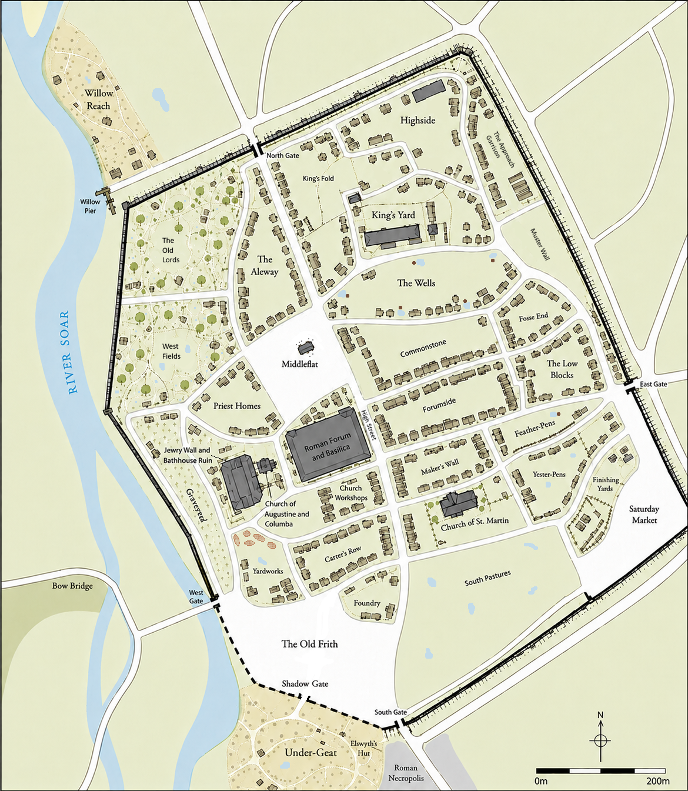

## Leicester AD 933-943

##### Legend

| **Location**                  | **Description**                              |
| ----------------------------- | -------------------------------------------- |
| Elswyth's Hut                 | Charcoal burner's cottage                    |
| Under-Geat                    | Church-protected hamlet                      |
| Roman Necropolis              | Ancient Roman cemetery                       |
| Shadow Gate                   | Church gate and Under-Geat entrance          |
| Old Frith                     | Church market and gathering place            |
| Church of Augustine & Columba | Minster, sanctuary, and 50-foot bell tower   |
| Priest Homes                  | Clergy residences                            |
| Church Workshops              | Church carpenters and craftsmen              |
| Bell Foundry                  | Casting church bells                         |
| Yardworks                     | Salvaged Roman building materials            |
| Carter's Row                  | Cart yards and ox-pens                       |
| Church of St. Martin          | Parish church                                |
| Jewry Wall                    | Surviving Roman wall                         |
| Roman Bathhouse               | Ancient ruin and materials quarry            |
| Roman Forum                   | Ancient Roman civic center                   |
| Forumside                     | Inns, lodging, and civic workers             |
| Saturday Market               | Leicester's main market square               |
| Middleflat                    | Public commons and games                     |
| High Street                   | Main commercial thoroughfare                 |
| Maker's Wall                  | Artisan workshops and forges                 |
| Commonstone                   | Open Roman quarry, clay, and pottery trades  |
| Fosse End                     | Warehouses and freight yards                 |
| Willow Pier                   | Commercial river landing                     |
| Willow Reach                  | Riverside homes and boat landings            |
| Aleway                        | Granaries, taverns, and brewers              |
| Feather-Pens                  | Poultry yards                                |
| Yester-Pens                   | Livestock holding pens                       |
| Finishing Yards               | Livestock sales and processing               |
| South Pastures                | Livestock mustering pastures                 |
| Low Blocks                    | Laborers' neighborhood                       |
| The Wells                     | Public surface cisterns, capstans, and homes |
| King's Yard                   | Royal administration and courts              |
| King's Fold                   | Royal livestock pasture                      |
| Approach Garrison             | East Gate military camp                      |
| Mustering Wall                | Fyrd assembly ground                         |
| Highside                      | Wealthy homes and gardens                    |
| The Old Lords                 | Roman architectural estates and gardens      |
| West Fields                   | Orchards, rented garden plots, and apiary    |
| South Gate                    | Road to Northampton                          |
| West Gate                     | Fosse Way to Coventry                        |
| North Gate                    | Road to Nottingham                           |
| East Gate                     | Fosse Way to Lincoln                         |
