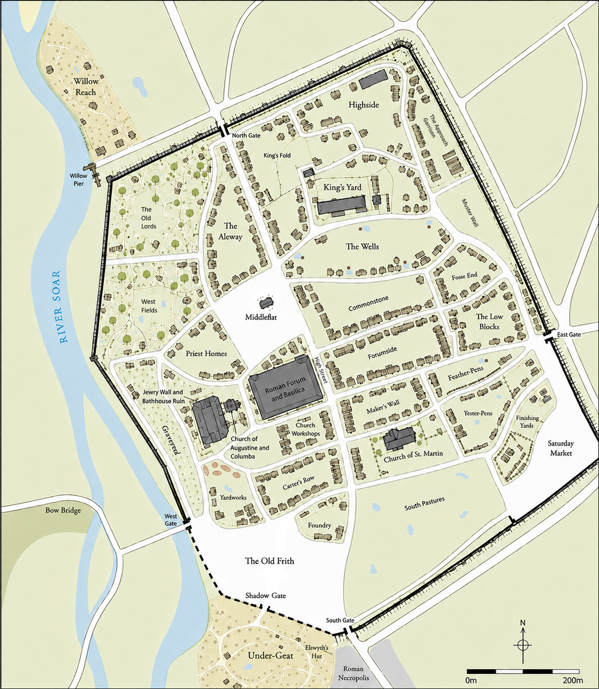

# The Cynn: Strangers To Wyrd

<!-- TOC START -->

## Table of Contents

- [Warning](#warning)
- [Prologue: Same Story, Two Tails](#prologue-same-story-two-tails)
- [Leicester AD 933-943](#leicester-ad-933-943)
- [Chapter One: A Promise of Piles](#chapter-one-a-promise-of-piles)
- [Chapter Two: The Tale of the Hearth-Warm Fyrdman](#chapter-two-the-tale-of-the-hearth-warm-fyrdman)
  - [Part One: Gerdr's Tears](#part-one-gerdrs-tears)
  - [Part Two: The Bowl](#part-two-the-bowl)
  - [Part Three: The Feared](#part-three-the-feared)
- [Chapter Three: The Tale of the Coal-Wise Apprentice](#chapter-three-the-tale-of-the-coal-wise-apprentice)
  - [Part One: The Hunters of the Pit](#part-one-the-hunters-of-the-pit)
  - [Part Two: The In-Between](#part-two-the-in-between)
  - [Part Three: The Feast Day](#part-three-the-feast-day)
- [Chapter Four: The Tale of the Bell's Deacon](#chapter-four-the-tale-of-the-bells-deacon)
  - [Part One: The Liturgy of the Bell](#part-one-the-liturgy-of-the-bell)
  - [Part Two: The Liturgy of the Road](#part-two-the-liturgy-of-the-road)
  - [Part Three: The Liturgy of the Sword](#part-three-the-liturgy-of-the-sword)
  - [Part Four: The Liturgy of the Wound](#part-four-the-liturgy-of-the-wound)
  - [Part Five: The Liturgy of the Shield](#part-five-the-liturgy-of-the-shield)
- [Chapter Five: The Blades](#chapter-five-the-blades)
  - [Part One: The Debate](#part-one-the-debate)
  - [Part Two: The Cynn](#part-two-the-cynn)
- [Chapter Six: The Night of Blood](#chapter-six-the-night-of-blood)
- [Chapter Seven: Barrow's Edge, The Hedge-Stalker](#chapter-seven-barrows-edge-the-hedge-stalker)
- [Chapter Eight: Monanleoht, The Battle-Dancer](#chapter-eight-monanleoht-the-battle-dancer)
- [Chapter Nine: Wodbora, The Madness-Bringer, The Prophet of the Wodhere](#chapter-nine-wodbora-the-madness-bringer-the-prophet-of-the-wodhere)
- [Chapter Ten: Getting A Handle On Things](#chapter-ten-getting-a-handle-on-things)
- [Epilogue](#epilogue)
- [Afterword](#afterword)
  - [Why Write This Book?](#why-write-this-book)
  - [Who Are The Cynn, Really?](#who-are-the-cynn-really)
  - [The Tenth Century](#the-tenth-century)
    - [The Church, The Shadow Gate and Under-Geat](#the-church-the-shadow-gate-and-under-geat)
    - [Leicester and the Peace of 943](#leicester-and-the-peace-of-943)
    - [Living Between Worlds](#living-between-worlds)
    - [Who Is Woden?](#who-is-woden)
    - [Wyrd (And Why It's So Weird)](#wyrd-and-why-its-so-weird)
    - [Inside the Debate](#inside-the-debate)
    - [Agency of Magical Artefacts](#agency-of-magical-artefacts)
    - [The Many Faces of the Wodhere](#the-many-faces-of-the-wodhere)
- [Swords and Scabbards: What Are These Blades?](#swords-and-scabbards-what-are-these-blades)
  - [Wodbora the Madness-Bringer, the Prophet of the Wodhere, the Guardian of Chaos](#wodbora-the-madness-bringer-the-prophet-of-the-wodhere-the-guardian-of-chaos)
    - [Description](#description)
    - [Blade Construction](#blade-construction)
    - [Handle Construction](#handle-construction)
    - [Scabbard Construction](#scabbard-construction)
  - [Barrow's Edge, the Hedge-Stalker](#barrows-edge-the-hedge-stalker)
    - [Description](#description-1)
    - [Blade Construction](#blade-construction-1)
    - [Handle Construction](#handle-construction-1)
    - [Scabbard Construction](#scabbard-construction-1)
    - [Inscriptions](#inscriptions-1)
  - [Monanleoht, the Battle-Dancer](#monanleoht-the-battle-dancer)
    - [Description](#description-2)
    - [Blade Construction](#blade-construction-2)
    - [Handle Construction](#handle-construction-2)
    - [Scabbard Construction](#scabbard-construction-2)
    - [Inscriptions](#inscriptions-2)
- [AFTERLIFE](#afterlife)

<!-- TOC END -->

[↑ Back to Table of Contents](#table-of-contents)

## Warning

The following novel contains extreme tonal whiplash. Please stop reading if you encounter any of the following symptoms:

* neck pain or dizziness
* numbness in your hands, feet, or speech center
* adding "ditch-meat" to your culinary vocabulary
* an irrational distrust of cough medicine
* looking for glass and sheep's stomach during pottery class
* re-decorating your entire house on the advice of a ghost living in your floorboards
* a sudden urge to name a body part and declare it as your next band member
* a need to interrogate robots to determine if they're hearing voices
* a sudden urge to take your entire farm to the spa
* worrying about timing flea jumps down to the picosecond
* thinking Chaucer's narrative structure could use some raven flair
* trying to understand why dragons have so much fun _and_ why it's better if they accessorize
* wondering why a disclaimer list has such _bizarrely specific_ warnings
* wondering, after reading, whether you should post a list of additional _bizarrely specific_ warnings this disclaimer somehow missed
* anything your local blacksmith or raven cannot adequately explain

If any of these symptoms persist please contact your local philosopher or theologian immediately.

However, if any of these symptoms seem even the _slightest_ bit delightful... welcome to _The Cynn_. By the end of the book, you'll understand why.

[↑ Back to Table of Contents](#table-of-contents)

## Prologue: Same Story, Two Tails

High above the world, where the winds carried the words of kings and beggars alike, flew two ravens. One was called Huginn. His mind delighted in possibilities, forever wondering what might yet be. The other was Muninn. He remembered every face, every word, and every deed he had ever witnessed since the beginning of time. Long had they wandered the lands of men, brothers-of-the-wing, gathering ancient stories to carry back to their master.

The two landed on a branch in a park.

The children sat in a ragged circle in the tall grass, their eyes fixed on the two black shadows perched on the ancient, iron-grey limb. The ravens waited for the last stragglers to settle and the whispers to fade.

"A story for the young-lings, to feed their hungry minds!" Huginn croaked, his beak sharp as a needle.

"Which story? There are so many to recount." Muninn added.

Huginn: "Beowulf! A sad and lovely tale..."

Muninn waved a wing... "No! They'll never remember it. Too boring for young minds."

Huginn: "How about the saga of Sigurd the Dragon Slayer?"

Muninn: "I told that story last week, remember? Pick again!"

Huginn tilted his head, a single dark eye gleaming with a sharp calculation that vanished the instant his beak opened.

"Wait," Huginn chirped innocently. "What about the one where... oh, what was it? There were these humans on a road. They got stuck in the mud. And the Boss gave them stuff."

Muninn snorted, his feathers ruffling with immediate, superior irritation. "You absolute bird-brain. That wasn't a simple mud-stuck caravan! That was 943 just outside Leicester! Always the slaughter with you, always the murderiness hidden beneath a bog!"

Huginn: "Ohhh, NOW I REMEMBER! ... Leicester, mud, wolves, three important humans, other less important humans, ruins, mayhem, giant reveals, _spectacular mayhem_, and laundry."

Muninn nodded arrogantly and turned to the park. "Listen well children. Commit this to mind and memory, for it is a tale of ..."

Huginn interrupted. "Cah! I'm the heart, the poetry, the soul... who better to tell the tale than me? I connect all the pieces into the epic tale that it is. It's... mine!" Huginn beat his wings and repeated, "mine! mine! mine!"

Muninn, rolling his obsidian eyes, shook his head... a slow shake practiced from seemingly the beginning of time itself. "You... ALWAYS... want to own the tale. Thankfully, I'm here... to keep the oath of the thing true. Proceed."

Huginn continued, the twinkle in his eye betraying the smile his face couldn't give. The children stared as he spread his wings and spoke of faraway lands and ancient deeds; of foul creatures, ghosts, and goblins; of myths and legends, and the truths hidden behind them.

"It all started at the end of the Siege of Leicester, 943 _Anno Domini_, in eastern England. I believe it was... the rains of spring."

"It was Saturday, March 25th," Muninn interrupted. "And it was the morning of Easter Eve."

[↑ Back to Table of Contents](#table-of-contents)

## Leicester AD 933-943

##### Legend

| **Location**                  | **Description**                              |
| ----------------------------- | -------------------------------------------- |
| Elswyth's Hut                 | Charcoal burner's cottage                    |
| Under-Geat                    | Church-protected hamlet                      |
| Roman Necropolis              | Ancient Roman cemetery                       |
| Shadow Gate                   | Church gate and Under-Geat entrance          |
| Old Frith                     | Church market and gathering place            |
| Church of Augustine & Columba | Minster, sanctuary, and 50-foot bell tower   |
| Priest Homes                  | Clergy residences                            |
| Church Workshops              | Church carpenters and craftsmen              |
| Bell Foundry                  | Casting church bells                         |
| Yardworks                     | Salvaged Roman building materials            |
| Carter's Row                  | Cart yards and ox-pens                       |
| Church of St. Martin          | Parish church                                |
| Jewry Wall                    | Surviving Roman wall                         |
| Roman Bathhouse               | Ancient ruin and materials quarry            |
| Roman Forum                   | Ancient Roman civic center                   |
| Forumside                     | Inns, lodging, and civic workers             |
| Saturday Market               | Leicester's main market square               |
| Middleflat                    | Public commons and games                     |
| High Street                   | Main commercial thoroughfare                 |
| Maker's Wall                  | Artisan workshops and forges                 |
| Commonstone                   | Open Roman quarry, clay, and pottery trades  |
| Fosse End                     | Warehouses and freight yards                 |
| Willow Pier                   | Commercial river landing                     |
| Willow Reach                  | Riverside homes and boat landings            |
| Aleway                        | Granaries, taverns, and brewers              |
| Feather-Pens                  | Poultry yards                                |
| Yester-Pens                   | Livestock holding pens                       |
| Finishing Yards               | Livestock sales and processing               |
| South Pastures                | Livestock mustering pastures                 |
| Low Blocks                    | Laborers' neighborhood                       |
| The Wells                     | Public surface cisterns, capstans, and homes |
| King's Yard                   | Royal administration and courts              |
| King's Fold                   | Royal livestock pasture                      |
| Approach Garrison             | East Gate military camp                      |
| Mustering Wall                | Fyrd assembly ground                         |
| Highside                      | Wealthy homes and gardens                    |
| The Old Lords                 | Roman architectural estates and gardens      |
| West Fields                   | Orchards, rented garden plots, and apiary    |
| South Gate                    | Road to Northampton                          |
| West Gate                     | Fosse Way to Coventry                        |
| North Gate                    | Road to Nottingham                           |
| East Gate                     | Fosse Way to Lincoln                         |

[↑ Back to Table of Contents](#table-of-contents)

## Chapter One: A Promise of Piles

The Saxon armies had gathered from icy roads far away, to deliver death to the Danes who occupied Leicester. 

---

Muninn: "You mention death in your very first sentence? These are children, Huginn, not morticians."

Huginn: "I think it's polite."

Muninn: "To announce death so casually?"

Huginn: "To announce that the buffet has arrived. I wouldn't want anyone feeling left out."

Muninn: "They're human. Not ravens. They're not left out."

Huginn: "Well, good thing it's just a story then. How does etiquette work here? Do I offer them a juice pouch... or maybe a nice mutton sandwich?"

Muninn: "You keep reading... _the story_."

---

Inside the city walls, King Olaf Guthfrithson studied his enemy.

He was no common sea-raider.

King of Dublin and claimant to York, he heard of King Æthelstan's death in 939 and learned that Æthelstan's brother Edmund, a youth of eighteen winters, had been proclaimed King of the Saxons. The boy had even assumed Æthelstan's title of King of the English. Olaf wagered that parchment and trinkets could proclaim a king. Only men standing knee-deep in mud could prove one.

There could be no better time to reclaim the Five Boroughs of the Danelaw.

For generations those boroughs had passed back and forth between Saxon and Danish kings, won at terrible cost and lost almost as quickly. Every generation believed it had settled the question. Every generation discovered otherwise.

He was no relic of the old sea-kings. Olaf had been baptized into Christ, heard Mass, and ruled among Christian subjects. Yet the old ways lingered in his halls. Many of his warriors still swore by the Norse gods and still sought the kind of death worthy of remembrance.

Olaf descended upon the Danelaw. He took York easily. By the autumn of 942, Leicester 
had fallen into Danish hands, and he held it through the winter.

King Edmund had called upon his lords to deliver a force to re-take Leicester. His lords answered.

The armies fighting for Edmund came from East Anglia, Mercia, Wessex, and even Northumbria. Mercenaries came from every corner where the news of silver could spread.

At their head stood King Edmund I, now a man of twenty-two winters, and King for four. Beside him rode Archbishop Oda of Canterbury, a Dane by birth and an Englishman by conviction, whose prayers carried nearly as much weight as the king's commands.

For weeks the armies had tested Leicester's walls. They were stout and well defended—except in one place.

The southwestern wall was crumbling. Between the South Gate and the West Gate stood the Shadow Gate, where age and neglect had reduced the Roman masonry to little more than a timber-reinforced scar. Every soldier knew it was the city's weakest point.

Yet no one attacked it.

Because of the _frith_.

"Oda, you must see this my way." The King stared at the South Gate. "Good men will die if you don't."

Oda said nothing.

"The Shadow Gate is scarcely a wall anymore," Edmund continued. "A few hundred men could force it before noon."

"They could."

"Then why are we still standing here?"

Oda looked toward the church belltower rising above Leicester's rooftops.

"Because the path runs through Under-Geat."

Oda sighed, and his hand found his golden cross. "My lord King, my answer has not changed. The Church's _frith_ is a covenant. We do not merely cast it aside for convenience. To ask this of me on Easter Eve borders on blasphemy."

The King leveled an icy stare at Oda. "I would hardly call the deaths of a few hundred men, taken while reclaiming a city for Christ, a matter of _convenience_. Olaf may call himself Christian, but too many of the men behind those walls still kneel to the old gods."

Edmund motioned to the walls.

"And what of the Christian souls inside? Is the concern for the Church's _frith_ more pressing than their prayers for deliverance?"

"The _frith_ exists _for_ their protection, Edmund. Not in spite of it."

Edmund looked back toward his army. Most of the spears before him belonged over hearths, not in the king's barracks.

"Too many men have died. We have no more time, Oda. Planting will soon be upon us, and with that the _fyrds_ go home."

Oda's gaze turned upon a wall of willows to the west of the road. Beyond the willows was Under-Geat.

"Then swear to me: the villagers will be unharmed. And you must not raise a hand against anyone who does not raise one first."

Edmund narrowed his eyes. "I cannot guarantee the safety of every soul."

"You can swear before God that you will try."

"Aye. But when the fighting starts, my men's lives mean more to them than my oath."

Oda pursed his lips.

"At least let me send word to the villagers to abandon their..."

"Absolutely not! The moment Olaf sees the villagers being escorted away, every spear in Leicester will be guarding that wall."

Oda paused for a moment, a smile forming at the corner of his mouth.

Oda raised his eyes. "Every spear?"

Edmund scanned from Under-Geat to the East Wall.

"Of course! CAPTAINS!"

His commanders rode up on their horses.

"Tell your baggage masters I want all supply wagons outside of Under-Geat. Clear the willows and brush to make room. _And make a show of it_. Then gather the ladders and all horses. Pick your finest riders. When I give the signal, tell them to ride hard for the East Gate and scale that wall. They'll have moments to open that gate."

He looked each captain in the eye.

"Make them count."

Edmund scanned his men once again.

"The rest will stand in Under-Geat. I want their spears held high so that any Dane that can count will see our number. And they'll see me at the fore and know this is my decision."

He looked back at Oda.

"I swear to you and before God I will try not to harm a Christian soul within the _frith_ by our hand."

He smiled.

"When we know the East Gate is open, the swiftest army will be the one to keep it."

He then summoned one captain to step forward. The captain was Galindo, a Spaniard who served as reeve of a remote Tyne River fyrd. He had spent most of his life counting wagons, settling disputes, and calling men to the fyrd—not leading assaults upon stone walls.

"Galindo, when we commit to the East Gate, stay behind hidden in the willows. When Olaf answers the East Gate, see what he leaves behind. If the Shadow Gate be lightly held by pagan souls, take it. The villagers will be cleared, so use what force you must. Keep that gate open and signal me when you have it."

He grabbed the captain by his tunic.

"If we hold the Shadow Gate and occupy the East Gate, their flank will be exposed. With God's will, we'll have both by nightfall. Speed is everything."

"God's will," was all he could muster.

Edmund nodded.

He turned to gather his forces.

Behind the Forum walls, Olaf's captains stood in a ring around a map carved into the courtyard mud.

Olaf traced the roads with the tip of his spear.

"Edmund has gathered here, before the South Gate. Since arriving, he has tested every road gate."

The spear moved from one mark to the next.

"North. East. South. West."

He looked up.

"Each time we answered with steel."

A wolf-man of the Danes stepped forward, a burly captain named Wulfhere the Broad. He was a member of the _Ulfhednar_. Their reputation for wild savagery needed no introduction.

"The Shadow Gate remains lightly protected. That will be his next objective. Assign more men there."

Wulfstan, the Archbishop of York and close ally of Olaf, stepped forward in his soft furs and gold-encrusted cross. 

"My lord Olaf, Oda is with them. He will protect that gate."

Wulfhere spat towards the bishop's fur-lined boots.

"You think like a wolf cub who thinks his mother will protect him from the bear."

Wulfstan ignored the challenge. He turned to Olaf.

"Oda _will_ protect the Church's _frith_."

"Then stand in the breach," Wulfhere barked.

He planted his spear in the middle of the Shadow Gate and held it there.

"Stand here. Hold your cross out and command them to stay their hand..."

A smile crept over Wulfhere's face.

"...as they walk right by you."

Some of the captains laughed, others were deadly serious.

"You don't know these men," Wulfstan objected.

"But I know the ground, Bishop. I've been through that wall. Have you?"

"Enough, Wulfhere." Olaf's voice was steady and commanding.

"You've made your objection known. See to your wolves."

Wulfhere scowled at Wulfstan as he turned quickly to leave. He left his bootprint on the Shadow Gate.

Olaf turned to the group before him.

"Watch the roads. If Edmund and Oda turn toward Under-Geat, reinforce the Shadow Gate at once. They will find steel waiting for them."

Wulfstan nervously rubbed his cross in his fingers.

"We must not offer such offense as to have them think we have broken the _frith_."

Olaf put his hand on Wulfstan's shoulder and smiled.

"No. I want him to count spears. Let him be the first to choose steel over peace."

Night fell that day on the Saxons inside Leicester. Many men were lost on both sides. And many more would surely die if a peace could not be had. For the Saxons, the action had been a day of success, but a night of frustration.

The Danes lost both the East Gate and the Shadow Gate. Soon after the South and West gates fell as well. But Olaf had prepared a contingency. All roads to the North Gate were barred. The Forum stood like a castle before the Saxons. And each crossroad and home stood like a shield-wall. Each step would be paid for in blood.

Oda waited that night in the nave of the Church of Augustine and Columba. Wulfstan waited at the entry of the Forum, a mere eighty paces away. And yet, they stood worlds apart. Each had sued for peace.

Wulfstan walked alone from the Forum's archway onto the steps of the Church. The Saxons eyed him cautiously, but still revered his cross as he held it plainly as his shield. Many crossed themselves as he passed.

Oda received him with a scribe by his side. A table and three chairs had been brought. On the table lay lit candles and the implements of statecraft.

Oda motioned his hand to the chair.

"Peace of the Resurrection be with you."

Wulfstan looked at the chair that was offered. He did not sit.

"And with you. But before we begin, Oda, we should pray."

Wulfstan turned and knelt before the altar, his weight gently pressing into the cushion.

Oda joined beside him.

"If you'll permit me..." Wulfstan bowed his head.

"_Beati pacifici, quoniam filii Dei vocabuntur_. (_Blessed are the peacemakers, for they shall be called the children of God._)

Silence fell over the church.

Oda bowed his head.

"_Misericordia et veritas obviaverunt sibi; iustitia et pax osculatae sunt._" (_Mercy and truth have met one another; justice and peace have kissed._)

They each prayed upon the words in silence for a long moment. They then rose and were seated.

Oda sat directly opposite Wulfstan, the flicker of candlelight illuminating the matching rings on their fingers.

The scribe uncorked his ink.

Wulfstan folded his hands before him.

"My king bids me ask your terms."

Oda shook his head.

"No. Tell me yours."

Wulfstan did not hesitate.

"The Forum can withstand another fortnight."

Oda looked at him curiously.

"Only a fortnight?"

"Our grain will stretch further if we butcher the horses."

"The Saxons have no wish to starve you."

"I know."

"Then why only a fortnight? I think you underestimate your own men."

Wulfstan frowned.

"My own men?"

"You count only grain and horses."

Wulfstan rested both hands upon the table, but gave no response.

Oda leaned in.

"I count desperation. The men in your Forum know there is nowhere left to retreat. Every father will defend the next doorway as though his own children slept behind it."

"They will."

Oda sat back and gave a weary smile.

"And we have spent weeks burying brothers beneath these walls. Every street we take will convince us the next one must justify the last."

The smile vanished.

"We both... the Saxons and Danes... will not stop until one army no longer exists."

The candles hissed softly.

Wulfstan finally spoke.

"You think the fighting will last longer."

"I think Leicester will consume every man either king has brought. But that is nothing..."

Oda paused to let his next words hit like a hammer. He swallowed hard.

"Leicester will be the undoing of Mercia."

The scribe stopped writing.

Oda turned toward the church doors.

"Edmund told me this morning that planting cannot wait."

He looked back.

"I fear even he has not understood his own words."

Wulfstan remained silent.

"The fyrd is not an army."

Oda's voice had become almost pastoral.

"It is a field with spears."

He let the words settle.

"Every week they remain in Leicester is another week fields lie unplowed."

"The Danes suffer the same."

"They do."

Oda crossed himself.

"God has already sent us three hard winters. Our granaries are not what they were."

"Then why should Edmund yield now, after all his gains?"

Wulfstan grew suspicious.

"Do you ask for our grain? Before, you meant not to starve us."

Oda's hands came down firmly upon the table. The inkwell jumped, and the scribe caught the parchment before it shifted.

"Because winter keeps no allegiance!"

The words hung in the air.

"If Mercia, Northumbria, Wessex... fail to sow..."

Oda looked beyond Leicester, as though he could already see the empty fields.

"...then children who have never heard the name Olaf Guthfrithson will die for this city."

Neither man spoke.

Finally Wulfstan broke the silence.

"What would you ask of my king?"

Oda looked directly into his eyes.

"For generations the Danelaw has passed between our kings."

"By sword."

"By sword."

"And now?"

Oda rested a hand upon the Gospel lying beside the candles.

"Perhaps it is time another judge decided."

Wulfstan's eyes narrowed.

"What judge?"

"God."

Silence.

"My king cannot abandon the Danelaw."

"I do not ask him to."

"What then?"

"Let Olaf hold what he now holds."

Wulfstan's brow furrowed.

"Until?"

Oda took a long breath.

"Until God renders His judgment."

"And how shall He do that?"

"When Olaf dies."

The room fell utterly still.

The scribe looked up from his parchment.

Oda continued.

"If Edmund cannot reclaim the Danelaw while Olaf lives, then let him press the claim when Olaf stands before Christ."

Wulfstan stared at him.

"You ask me to make my king's death the boundary of the peace."

"I ask you to let Olaf's kingdom be remembered for the souls he spared on Easter, not the lands he left his sons."

Wulfstan considered the words.

"Olaf will hate it."

"Edmund hates it even now."

"Then who shall love it?"

Oda looked toward the crucifix.

"I pray the widows."

---

Huginn: "Well, I hated it. Every scratched word on that page."

Muninn: "It was a very different kind of deal. Historians still scratch their heads to this day."

Huginn: "I was promised piles."

Muninn: "You were."

Huginn: "And I was denied."

Muninn: "Maybe there's a lesson. Always pack a lunchbox. Just in case."

Huginn: "And what do you suggest I put in this lunchbox?"

Muninn: "Juice pouch. Mutton sandwich. Everything a grouchy toddler needs..."

Huginn: "Are you saying I'm a hypoglycemic toddler?"

Muninn: "No. I'm merely implying it. And wouldn't a nice mutton sandwich be good right about now. Layers upon layers of greasy meat... hold the bread."

Huginn: "Stop teasing me!"

---

The previous night's funeral pyres were fed by the fallen logs of a shattered rampart, and the smoke drifted slowly through the battered streets of Leicester.

Before dawn, King Olaf Guthfrithson and Wulfstan departed the North Gate beneath a banner of peace.

When the crier mounted the Forum wall that Easter morning and held aloft the wax-sealed treaty, silence spread through both armies. The Danes gathered their dead, their baggage, and what remained of their host for the short road back toward the restored Boroughs of the Danelaw.

The _fyrds_ faced a much longer journey. They returned to fields already waiting for the plow, and to the knowledge that after months of hardship they had won nearly every battle fought with sword and spear.

The only loss, in their minds, was the one fought with ink.

Osric paid no attention.

He was a man of tall stature but hollowed by hunger, sickness, and wounded pride. He was an outsider like many from his fyrd, strange voices in a strange land. These fyrdmen, roughly a hundred strong, had been delivered for this battle from the Tyne River, a debt paid by his Northumbrian lord to the Saxon King. His sweat and toil were payment for a debt he didn't know. His own lord sat in his hall in Northumbria, far from the battle, warm and dry.

Osric's clothes were a beggar's hoard. He wore three tunics at once: a stiff, greyed linen undershirt that clung to his ribs, a moth-fretted green wool kirtle, and over that, a heavy, grease-stained warrior’s tunic, its sleeves frayed to the threads at his wrists. Around his shoulders, he had draped a heavy, mold-spotted blue cloak pinned with a rusted iron nail. His legs were a mismatched ruin of wrappings. His feet were stuffed into split-leather boots, wrapped over with greasy sheepskin rags to keep the dampness of the dirt floor from seeping into his bones. Beneath the mountain of damp wool, his face was gaunt, his eyes sunken, and his beard grown wild and tangled with bits of hearth-straw. He looked less like a man of the fyrd and more like a ghost made of rags.

Osric once held an honored position in the fyrd, a tall, proud warrior-farmer with the strongest back, who anchored the shield wall. But now, he dug latrines and wagons out of mud. When the news came, it didn't matter at the time. His attention was held by the carriage wheel that had detached, its axle flat in the muck. He didn't have time for parchment-deals, not when the baggage-master had a whip in the hand.

In the battle, his survival was not decided by skill. As well trained as he was, his tools of war were limited to a burnt-tip wooden pole... barely a wood-rake that had fallen into the campfire, and a broken training shield of thinnest wood. But now, his work was not a soldier's work, but that of a thrall.

Among the army of Olaf were Northumbrian levies, farmers like Osric from neighboring towns but paying homage to York instead of the Saxons. He had hoped not to meet them in battle, as his wife's kinsmen were from the _Piceringas_ near York, and he had traded with others on Olaf's side. 

Elswyth was from Under-Geat, a daughter of the charcoal and the forest. She seldom mingled with the village-folk now, for she had spent half her life balanced on the sharp edge between truth and lie. Which was which depended on who you asked.

She cared little what others thought of her. The quality of her charcoal came first. Her skill at coaxing a living from the forest was not far behind. Both kept her fed, and neither cared a whit for village gossip.

She was dressed for the damp forest and the heat of the char-pits, not the thread-wise handiwork of the linen makers. Her garments were a patchwork of scavenged pieces, each stained a different shade of black. Her coaler’s apron was a stiff, heavy sheet of cowhide, blackened by greased fingers and scorched by flying sparks. A short, green wool hood and waist-cloak shielded her shoulders from the damp spring drizzle, while rough wool wraps bound her legs to protect them from the forest's grasping briars. On her feet, simple leather turn-shoes, stuffed with dry moss to ward off the lingering chill of the damp earth, kept her grounded in the Leicester mud.

In the beginning, her family did the dirty work of managing charcoal pits with wood taken from the nearby Charnwood forest. The charcoal fed the Church bell foundry and the Yardworks' lime kilns. But now she was alone. She continued that work in the still of the night, away from the eyes and ears of the villagers.

For two months that spring, the Saxon horde had made Under-Geat their home. And for two months, Elswyth watched the forest awaken, filling her snares before filling her basket. She avoided the villagers when selling to the visitors, always drawing up her cowl before offering anything for sale. Mushrooms were often traded for broth. A small rabbit could bring a loaf of bread. But a marten's pelt could buy four suppers, and its meat would be the fifth.

That morning, she took the news of the peace with dread. She had no ear for war, but she also had no love for the Danes, especially those dressed as wolves. While the Danes ruled, she preferred the call of the forest birds to the sounds of the Vikings' boasts. Now with the Danelaw officially in the hands of the Danes, she wasn't sure that Leicester was her home.

Osric's Tyne River fyrd was one of the companies encamped just outside Under-Geat. Their wagon master was a Scot named Murdock, a fire-bearded man whose first instinct was always to count: wagons, oxen, barrels, sacks, and finally people. He had seen Elswyth faithfully deliver her bounty for several weeks. And with the mud, his count of spare axles was down to a single hand. He needed a forester to prepare for the worst. Broken axles did not grow on wagons, and hungry men did not march on promises.

Murdock offered her a place with the company before the wagons departed north. She accepted before she had time to think better of it. The ruin of her coaler's hut held little worth taking: a blanket, a knife, a cooking pot, her father's aging felling axe, her wedge-driving cudgel, an assortment of iron and wooden wedges, her clean Easter tunic wrapped in linen, and the twine and triggers of her traps - all kept in a bundle of empty charcoal sacks.

And finally, her hand found the smooth lump of coal in her pocket, polished over years of handling until it shone like black glass.

She was ready to go.

By the time she returned, the wagons were already creaking into motion. Rather than wave farewell to a hamlet that had never quite been home, she slipped beneath the canvas of one of the baggage wagons and let Under-Geat disappear behind her.

The train wound its way through the cluttered streets of Leicester. The town was still reeling from the aftermath of the siege. In the rain, the train would stop three times to remove barrel barricades and debris from High Street.

The peace was emptying the city as surely as the siege had filled it. Wagons, drovers, and laborers still streamed through the North Gate, and no one seemed in any hurry to bar it.

With the North Gate behind them, one of the wagons lurched. Again.

A veteran turned on the road, looking back at a hundred men with shields and spears waiting impatiently in a line. Behind them, the baggage wagons had stopped again, and the sounds of shouting carried through the rain.

Cynewulf, also of Leicester, was strong and salt-bearded, yet weary. A priest at first, he gave up that life for the life of a soldier and highwayman. He had the cake of the road stuck to him, a tired mercenary in this war, fighting for the Saxons. His foreign warband brought him to Leicester. They were harassing Viking reinforcements from York and had been very effective.

The moment their campaign ended, their charter bid them return home. They traded farewells, their road taking them north and then west to Powys, a far off region of Wales. Cynewulf watched them disappear down the road until they were little more than colored specks against the spring hills. Only then did he turn south back toward Leicester. The road felt quieter without them.

Cynewulf had the bearing of a soldier. His byrnie—once a proud shirt of black interlocking iron mail—was threadbare and sagging, missing clusters of rings that had rusted away and been crudely patched. Underneath the iron, he wore a quilted weapon-shirt of heavy linen. The quilting threads had snapped in dozens of places, allowing the dirty flax stuffing to leak out of the tears like tufts of sheep's wool. It was stiff with the salt of old sweat, and the shoulders were stained a deep, bloody orange where the rusting mail had bled into the fabric. His cloak was a new fur-lined trophy, as were his boots. At his hip hung an aging langseax whose edge rippled with shallow waves—the mark of a blade that had survived many battles and nearly as many blacksmiths. His shield had been split to splinters in the road engagements, and was gone. What little wealth he possessed came from the battlefield: fragments of silver, steel, and bronze scavenged from the fallen and not yet traded to the smiths for coin.

Cynewulf's vows were taken at the Church in Leicester, and that is where Elswyth once knew him. In those days, before he traded his vestments for a chain shirt, he was an acolyte who worked in the bell foundry. Her family's coal fed the fires then. He glanced at the church several times at night through the rain, trying to remember the lines of the bell-fry, the happier times. But now, with the siege ended, the church was the beginning of the next road.

With his warband gone, Cynewulf wandered south toward the North Gate to see where the wind wanted to blow him next. He knew the Church was offering crusts of bread and a bit of broth to those unfortunate souls who had nowhere else to be. That is how he happened upon the Tyne River fyrd. Roughly a hundred men stood in the rain watching one thrall kneeling in the mud yet again over a broken axle.

A man on an unusually fine horse rode up to him.

"Hail, soldier," a man said. "Lose your way, or has the way lost you?"

Cynewulf frowned. "What?"

The rider smiled. "A veteran walking alone back into the fire, lost in his thoughts? Either you lost your company, or they lost you."

Cynewulf snapped to the present and stroked his beard. "Both, I suppose."

The foreigner laughed. "Then today is full of surprises."

He extended a hand.

"Galindo. Reeve to the fyrd from the Tyne Valley."

Cynewulf shook it cautiously.

"Cynewulf."

Galindo glanced back toward the baggage train. Osric was still crouched over the broken wheel.

"Are you looking for work, Cynewulf? Because I am looking for men."

"For what?"

"For leaving." Galindo answered immediately. "The peace has been read. Half the fyrd is already thinking about sowing crops. The other half is thinking about their wives. I need guards for the baggage train before they begin their race to see which ones get home first."

Cynewulf followed his gaze toward the wagons.

"You don't know me."

"No." Galindo shrugged. "But I know what a veteran looks like."

"And?"

"The fyrd is an unbridled horse that smells home, and time is a luxury."

Galindo pointed toward the camp.

"Find me men who can stand watch, march in a straight line, and not rob the baggage train. Bring them to me before Osric finishes that wheel."

Cynewulf looked over his shoulder.

"And if I fail?"

"Then you'll prove I was wrong. And I'm _rarely_ wrong." Galindo smiled.

Cynewulf made haste into Leicester.

Cynewulf knew the very bandits he might face on the road to the Tyne, because he had once ridden beside them. He did not fear them. He did not respect them. He understood them. Men like that followed silver first and everything else second. Once, he had told himself he was no different.

He remembered how Leicester had worked before the siege. Spring had returned, and so had the work. He knew not to ask the woodsmen. The forests were calling them. Nor the millers, nor the carters, nor the smiths. Their trades had been waiting months for peace.

Instead he looked for the men who lingered after the others had found their purpose. He sought the men who were not eager to leave.

He passed The Aleway.

An ale-house would have been the obvious place to start, if there were still ale in Leicester.

He kept walking.

He realized the ones he needed were like him. He was already in search of food, heading toward the churchyard. The ones he wanted would be doing exactly the same.

Cynewulf crossed the open common of Middleflat, named for the great Roman stone foundation stripped bare and now serving as a speaking platform. Danes laughed as they hauled away barricades, tossing timbers aside as though they had never expected to need them again.

They had no time for him.

He certainly had no time for them.

He kept walking.

Cynewulf stopped between the Forum and the Church of Augustine and Columba. As a deacon and then priest of this church, he had seen this sight a thousand times.

The Church looked the same. The Jewry Wall and the belltower always seemed to be giants trying to decide which was taller, and the belltower always seemed to win the debate.

But he had never seen the Forum so scarred. Danes were pulling barricades from the Roman archways. Beyond them lay a wreck of splintered timber, soot, filth, and the lingering signs of death. He looked away.

He stepped towards the Old Frith. He didn't expect to see piles of rubble.

The old bathhouse behind the Jewry Wall was being excavated. Before him lay untidy heaps of marble, brick, timber, roof tile, and broken stone.

"Someone's been busy," he said to himself as he strode by.

Cynewulf scoured the Old Frith with his eyes, like a wolf searching for another who had lost its pack. A man in a hurry to reach his wife was already on the road. A man eager to sow his fields was packing his cart. The men lingering over their broth interested him most.

That was where he found them.

The first was an old veteran resting against a fence, wrapped in patched mail and carrying a broad shield and a bearded axe. His hair and scars spoke of Denmark. His manners spoke of Mercia. He answered Cynewulf in fluent English before finishing the question in Norse. Whatever side he had once fought for, he had survived long enough to know both.

Nearby, a one-eyed archer had the church cook laughing so hard she nearly dropped the ladle.

Cynewulf asked, "So does the arrow always follow where you look?"

"Close enough."

"But don't you need both eyes?"

"Both eyes? My enemies and the ladies already know." He finished his broth in one gulp. "I only shoot in one direction anyway!"

Cynewulf smiled despite himself.

Two young brothers sat apart from the others, their shields stacked neatly beside them. Their eldest brother's warband had left before dawn without waking them. Whether through cruelty or indifference hardly mattered now. They wore the wounded pride of men determined never to be left behind again.

The last two caught his attention before he reached them. They dressed like Northmen, but not Danish Northmen. Their armor wasn't mail at all, but hundreds of small iron plates laced together until each man seemed wrapped in the scales of some great fish. They spoke to each other in Norse, but it rolled off the tongue with a cadence he didn't expect. When Cynewulf asked if they had served Olaf, they laughed together and spat into the dirt.

"Never him."

They offered little else, though they seemed to understand him well enough. At the mention of silver, they exchanged a glance, rose, and shouldered their shields.

They all agreed to follow him to the Tyne for silver. Cynewulf gathered them and led them back toward the baggage train. He had assembled a number of warbands in his life, often before he had even realized he was doing it. Usually the question was who might help him take a wagon. This was the first time, he had judged men by who might keep one from harm.

Galindo looked up from the baggage train as Cynewulf approached with the recruits in tow.

"Well," the reeve said. "Either I've made a terrible mistake, or you've solved my problem."

The one-eyed archer raised a hand. "Could be both."

Galindo groaned. "Excellent. _It_ talks. Maybe when _it_ is done talking, we can see what you are."

The company chuckled.

Galindo walked slowly down the line, taking inventory. Spears. Shields. Axe. Bow. Scars. More scars.

Galindo eyed the old veteran's leg. "Can you march without limping?" 

"Aye. Can you count without fingers?" The old veteran smiled.

"I hope that wasn't a threat." Galindo paused, then nodded toward the wagons.

"Tyne Valley. Escort duty. Food from the train. Twelve pennies a week."

The veteran spat into the dust. "Fifteen."

The archer interjected. "He's right."

The brothers exchanged a glance.

The Northmen shrugged.

Galindo snapped back, "Some of you are worth that, some far less."

"We'll play no favorites here. Thirteen," Cynewulf said.

Cynewulf had seen uneven pay and jealousy destroy the petty warbands he built before when he was too drunk to care.

Cynewulf looked down the line at the youngest men.

"You heard me. You'll earn the difference."

Blank faces looked back.

"You fetch water. Gather firewood. Tend horses. Sharpen spearheads. Cook. Take first watch. Let the seasoned men sleep."

He looked each of the younger men in the eye.

"And when new members join, you'll be the veterans."

Galindo studied him for a moment.

"Fine. Thirteen."

The veteran gave Cynewulf a sharp eye, then nodded.

"Done."

Galindo extended his hand.

"Then welcome to the baggage train."

Cynewulf took the old veteran aside. "Didn't catch your name."

"Didn't give it. Men I let live, they call me Tor. Everyone else keep their peace." He gave a wry smile.

"Tor short for anything?"

"Depends on who you ask. My father, Thorvaldr. If my mother held the dough-hammer, Tor it was. My father always laughed that when the men came around looking for provisions, they threatened to take my mother on campaign as their dough-valkyrie."

"Sounds like your mother won, if your name now is Tor."

"Aye. That's what she says."

"How are you with supplies?"

"Fine. I know how to count heads, mouths, and bags on horses. Been around long enough to measure a man by his bowl."

"And loot? You know how to sell?"

"Ha. I was selling my mother's famous herring hand-pies before I was seven winters. Thick rye crusts, hard as little treasure chests. You could drop one in the mud, leave it there a day, crack it open, and the herring inside would still be sweet. I'd leave the hearth with a basket of pies and come back from York's docks with a sack of herring and a handful of pennies. And the docks of York aren't the churchyard either."

"Were you fighting for the lords of York then?"

"Ech... no... I came her not for the siege, but for the peace. Who can ask a man to choose between mother and father? No, I sell my spear only when the shield-walls get smaller."

"So... what if we change your name. How do you like Quartermaster?"

"Quartermaster? For thirteen? I was a spear at thirteen pennies. And don't we already have a quartermaster?" He scoffed.

"This company answers to me, not the reeve, and not Murdock. We'll run loot like my old company, the Griffons. Killers get first pick. The rest comes through you. You set the worth. If a man wants something, he buys it from you. Men don't sell to each other. Cheated men start knife fights. You keep the company purse, and you take a cut of every sale. The purse pays every man's share on the spot. Then you sell the loot in town to fill it again. I'll count the coin at day's end."

Tor didn't think long. "Well then I'm _your_ Quartermaster at thirteen."

The archer had been listening, and leaned into Tor and Cynewulf.

"So what's this pretty little band going to be called? And will we be seeing each other after the Tyne?"

Tor looked at Cynewulf, and shrugged.

Cynewulf stared at the mud. "Let the bards name us. They'll know if our deeds were worthy of one."

Tor smiled. "Well, that saves coin. I won't have to ask for paint or banners."

Galindo led Cynewulf's company to the wagons.

The archer stopped dead in his tracks.

"Those wagons? Are we guarding them or pushing them in the mud with our bare hands! They're going nowhere."

"God help us," muttered one of the brothers.

"I don't think he's listening," replied the archer.

"Who, Galindo, or God?" replied the other brother.

"Both." One-Eye pressed the iron cross at his neck to his lips. "Forgive me, Father," he whispered, "I know not all our trials are alike... but it seems You've been favoring the mud lately."

"Best be settling in. Report to the wagon master," Galindo replied.

High above the town, perched on the highest wall of the Forum, Wulfhere studied his enemy still. The _Ulfhednar_ were the wolf-men of the Danes, men who married their souls to the wolves of Odin. Though his kind's number were dwindling on the island, he was fierce and true to his kind. To him, the brokered peace was a thing for priests and deer-meat. He had lost some of his number in the fighting before, but the trophy pile was small, and many of his number still longed for Valhalla. 

He finally gave the wave to signal the _Ulfhednar_ advance out of the camp. They weren't staying in Leicester. The spring thaw had opened the river-roads, and there were estates to the north and east that hadn't seen a blade in months. There were _karvis_ to be seized in the fishing villages of the estuaries—small, fast boats and poorly guarded—which would lead to a summer of raiding the coast.

Wulfhere led his company of fifteen through the North Gate. The fyrd caught his eye.

Wulfhere, ever an eye of the hunter, spotted the wagons and their guardians. His keen eye pushed past the broken ox-carts and saw the true nature of the Saxon rearguard.

He saw the fyrdmen nervously shifting their weight. He saw the pursing of Galindo's lips. He saw the strain on Murdock's face.

He knew that his baggage train was not going to have an escort much longer.

From behind the canvas, Elswyth peered out to see Wulfhere. She caught her breath. He must not see her. 

She sensed his eyes scanning the wagons. She wondered what he had seen.

The other Vikings laughed and joked at the state of the fyrd as they passed by. Vikings were often blind to their own state, for they carried no excuses for themselves. Instead, they carried on with their merry advance on the Boroughs. But not Wulfhere. He was studying, and now he finally liked what he saw.

"Move along, wolf-men. Our quarrels are buried," said Cynewulf, trying to ensure a fight did not break out. He stepped in front of the fyrd before some loose tongue started a fight.

One of the wolf-men jumped to Cynewulf standing toe-to-toe, with a wide grin. He smiled with yellow teeth, knowing that Cynewulf's leash was the parchment. The wolfman barked and howled, the saliva spraying against Cynewulf's cheek. Cynewulf didn't blink. He didn't move. He just stared through the man, his eyes as flat and grey as the Leicester mud. "Move... along..." he repeated. 

The wolf-man’s grin faltered slightly against that hollow stare, his howl dying down into a low snarl. He spat on the ground between them, then turned back to his pack with a mocking bark of laughter. "Sheep! Look at the sheep!" the wolf-man jeered, their laughter echoing off the damp stone walls as they turned away. "Where is your shepherd, sheep? Maybe we own the leash, eh?"

Wulfhere looked on in approval, watching the challenge with a smile. He liked to know the character of men well before their throat met his blade. With one last glance, he turned with his men and headed north.

Cynewulf watched in silence as their heavy boots found the road. He slowly released his breath - a long shuddering exhale. He stared down at the deep, muddy impressions of the wolf-man who had stood nine inches from his. He slowly, deliberately pushed back an iron spike from the palm of his hand into a sleeve-sheath. The cold metal slid and locked away, leaving his palm as empty as his eyes. He turned his back to the road to survey the state of the wagons.

Cynewulf's new men had watched the exchange in silence.

One-Eye was the first to speak. "Well. That's one way to find out if a man's brave."

Tor shook his head. "Not brave."

The archer frowned. "No?"

Tor spat into the mud. "Brave men get themselves killed proving it. Wise men have fear. They just don't show it."

Cynewulf approached, and the brothers exchanged a glance. "Have you ever fought one of them? The wolf-men I mean," asked one.

Cynewulf did not look up from the wagons. "Stow your gear. I don't think we're leaving tonight." He nervously looked back up the road.

Neither brother asked again. The answer settled over the group like a cold rain.

One-Eye stared after the departing wolf-men. "Well," he muttered, "good thing you didn't piss your pants. I'd have to worry about us if you did."

That got a laugh from everyone except Cynewulf.

After traveling a distance, the _Ulfhednar_ stopped to rest in a clearing. Wulfhere was there, urging his men to gather around. His eyes seemed fixed to Leicester, wide and full of intent.

Among them were his best. His second-in-command was a giant, over seven feet of bone and muscle, Rognvaldr the Ragged. His frame was so large, no single mail coat could cover it. It was a mosaic of armor that served as the testament to the war-band's kills, as it was built from the pieces of armor of the fallen. The others were lean and hungry, mostly young but scarred by the unending training of the wolf cult. Their eyes burned for the treasure-pile that had once been promised or the final embrace of valkyries. Both would have to wait as long as peace reigned. 

Wulfhere began. "I see the anger in your eyes. I see his words turned to rot in your minds. We have followed Olaf. We have listened to the fat jarls of York. We have seen what their guidance has brought."

He started pacing before them, staring at each man as he spoke.

"Did they listen to me when Oda ignored their own peace and stormed the southern wall? Did they take the fight to the Saxons when they were drawing their noose around us? They don't care about us! They never asked the wolf if the fighting was done! They promised piles and delivered ash. Olaf can rot in Helheim!"

Rognvaldr stepped forward, his arms reaching wide. "Come brothers! We feel your anger. We feel how you were betrayed. Look each other in the eye! Let your eyes show your brothers that you will not be denied!"

Wulfhere continued. "These Saxons... they keep making the same mistakes. They think wolves feast on air and priest-speech. A wolf cannot eat a peace-meal. I have seen their broken bands, their burnt sticks, and the forest girls they have guarding their baggage. They are deer for the slaughter, friends. We are circling back tonight. Let the others crawl to the Boroughs and reclaim just what the Saxons allow them."

Rognvaldr started a drum chain. Each wolf began to slap his thighs in unison, a guttural grunt marking every fourth beat. The rhythm was a heartbeat—the heartbeat of a pack that had forgotten how to be men.

"_We_ will collect the hoard-pile we were promised yet. Then we'll move to the coast estates, and cut that belly from groin to neck. And if we fail?"

Wulfhere paused, looking into the eyes of each of his wolf-men, one at a time. Their eyes were wide now, their hands slapping rhythmically against their thighs faster and faster. Some were growling, some barking, and others stood with thick, white saliva dripping from their hungry maws.

Rognvaldr moved down the line like a butcher personally checking each slab of meat on the hook. He wasn't a man of words, but he was a master of the frenzy. He grabbed the youngest of the _Ulfhednar_ by the shoulders and screamed, inches from the boy's face. The youth screamed back, a raw, visceral sound, and lunged forward.

He sank his teeth into Rognvaldr’s arm.

Blood dripped from the arm, wetted by the young wolf's saliva.

Rognvaldr only roared in approval, shoving the boy back into the pack.

Wulfhere seized the moment, his voice cutting through the chaos:

"AND IF WE FAIL... I have glorious news!"

He paused again, spreading his arms wide, his eyes fixed on the grey expanse above as if he could see through the clouds to the All-Father himself.

"Our reward is... Valhalla!"

The men howled. The sound marked the soul leaving only the wolf behind.

---

Huginn: "No, wait... it was more like...  Valhallaaaaaaa...!!!"

Muninn: "Wrong. On both counts."

Huginn: "Those _Ulfhednar_ were truly stink-foul, weren't they brother? They smelled of rancid fat and bad intentions."

Muninn: "Bad intentions? Those don't smell. Otherwise you would be most ripe indeed. As for the _Ulfhednar_, they *were* our best providers you know... piles of dead warriors, Huginn. *PILES*. Our brothers would feast for moons."

Huginn: "I said stop teasing me!"

[↑ Back to Table of Contents](#table-of-contents)

## Chapter Two: The Tale of the Hearth-Warm Fyrdman

### Part One: Gerdr's Tears

Osric was a man of the earth, an Anglian, his hands calloused by wood and iron long before they ever held a shield. For many winters, his family's grain-bin was full and his hearth was warm and full of life. He was a simple man, strong of the back, and wise of the field and plowshare. He was also a proud fyrdman, keeping a stout shield with his father's favored pattern and boarspear mounted on iron spikes driven into the crossbeam above the hearth. He displayed them prominently, as he was the anchor of his master's shieldwall. The boarspear he had helped forge himself one hot summer six years previous, and it had served him well. The pole was a thick ash limb straight and true.

He was not an especially pious man. He had seen the shuffle of war—Norseman against Christian, Christian against Norseman—and too often the churches burned all the same. He did not doubt God existed; he merely doubted that God concerned Himself with the outcome of every skirmish and every harvest. Still, when the rains came late or the barley stood thin, Osric would sometimes offer a prayer for steady weather and a bountiful yield. Sometimes he offered the same prayer to Freyr, the Norse god of the harvest. It seemed no great offense to ask twice.

He attended the little parish church at Easter, at Michaelmas, and on the Feast of Saint Martin, when the livestock were culled for winter. Beyond that, he placed more trust in sound thatch, healthy cattle, a sharp spear, and the men who would stand beside him in the shield-wall. He kept a few old harvest customs besides. He left the last corner of the field uncut, in honor of the land, and wove the first sheaf of every harvest into the cottage door as a quiet sign of gratitude for the year's bounty. Whether the thanks belonged to Christ, to Freyr, or simply to the land itself had never seemed worth arguing over, so long as the barley ripened and his children had bread through the winter.

His cottage stood where the south-facing terrace gravels just west of the junction where the North Tyne and South Tyne merge, near _Hagustealdsham_. His forebears were present the day the village's first cornerstone was laid. The name of the village itself bore the weight of many landless sons who tried to find the secrets of the land. Some succeeded, but many did not.

"My father's family built the walls from the stones of the nearby Roman ruins, and the hearth with stones from the river," Osric would tell his fellow fyrd-men. "The land knew my forefathers almost three hundred years. My father said the land remembers those who tend it. My family was there in the beginning of the Great Heathen Snake... some Northmen had a keen eye for land, true, but many didn't want the land. They wanted the screams and silver. We survived those years through the sweat of our brow... we showed them what good Northumbrian muscle could do. Our villages worked the rocky fields, and bread poured forth to feed the snake. And for that, we were allowed to live."

Osric's wife was Ealhild, a woman of the Swedes.

---

Muninn: "Don't you mean _Álfhildr_? That was the name she was given at birth."

Huginn: "I'm not going to switch between _Álfhildr_ and _Ealhild_ just to satisfy your sensibilities. We're picking just one."

Muninn: "You're choosing her married name over her given name. Seems arbitrary."

Huginn: "I'm choosing the name that's easier for the children to remember. Now stop interrupting."

---

She had been born with the name _Álfhildr_, but over the years it had softened into _Ealhild_ upon Northumbrian tongues.

---

Huginn: "There, happy?"

---

She was well versed in the old Northern hearth-ways. Osric didn't marry her for a warlord's dowry. Ealhild's family were not the men chasing screams and silver, they were kindred spirits. They knew ancient hearth wisdom, and sought looser soil and rock-free gardens of the Danelaw. She was from a family that settled in the _Piceringas_, roughly sixty-five miles to the south-east. It was a lush valley, free of boulders, and easy to plow.

Her family was established enough for three generations. Her great-grandfather marched in Halfdan's host to take York. Passing through Whitby, he came across a peculiar stone by the sea, a flat of limestone with streaks of jeweled black. The stone was unusual, and he kept it with the baggage train. After the battle, he immediately found what he was looking for - a plot of land for his service. He lost his brother and several friends in that battle, and he constructed a new barrow on his land for them. The limestone was put as the cap on the barrow, the black jet streaks shining in the sun.

Her grand-father bred the first of the area's famous cows, and their wealth grew. In time, the family grew and prospered. Their cream was bountiful, and their butter was known for miles around.

Ealhild was the last of seven daughters, and her mother's apron-heir. She followed her mother every step, watching and learning. When her mother gathered herbs and roots from the eorth-hord, Ealhild was there. While her older sisters preferred the fields, the stream, or the company of other children, Ealhild lingered wherever her mother worked. She pretended to be Gerðr with her mother, tempting Freyr to lay down his sword and frolic with her. She also knew some of her mother's stories were invented on the spot, but another tale of Gullinbursti the Golden-Bristled Boar soaring over hedgerows, or butting a troll into a ditch for stealing barley, never failed to make her laugh. 

---

Huginn: "Super-BOOOOAAARRR!"

Muninn: "He is a divine entity of gold and bristles. You are a divine entity of rotten ditch meat."

Huginn: "He's a flying boar!"

Muninn: "Yes."

Huginn: "Boars are pigs."

Muninn: "Absolutely."

Huginn: "Do you know what this means?"

Muninn: "I have a distinct feeling you're going to tell me..."

Huginn: "Pigs CAN fly!"

Muninn: "I've met him. Very grounded. The fact that he can fly doesn't mean he's a super hero."

Huginn: "No, he's... Super-BOOOOAAARRR!"

---

Ealhild's family were superstitious. The family barrow was young by Northmen standards. Her great-grandfather had helped raise it after coming south with Halfdan's host. Each generation added something to it—stories, bones, stones, and memories—until it seemed older than it truly was.

Her mother taught her that one day, she would marry, and would travel far away. To carry the family traditions to a new valley was a great honor, and a great responsibility.

And that is how families grew.

When she went, she would take a barrow's capstone with her... to bring the spirits of her ancestors to help her tame her new land. Her mother would tell her stories of the black in the stone. "They are _Gerðr's Tears_, Ealhild. When she married Freyr, she stood at the shoreline, about to board _Skíðblaðnir_. She looked back. And she wept. Her tears ran black, and stained the stone," her mother said.

"But why was she sad?" Ealhild was truly concerned.

"She wasn't sad, Ealhild. She loved her mother, and she loved Freyr. Some tears are too big for one name. You will take the capstone with you when you are married. You will be as Gerðr, and you will find your Freyr."

That day came, as Ealhild's father was eager to expand northward. While much of the land in that direction was tough and bitter, the lands of the Tyne river had wealth and made for good grazing land. He had come to know of Osric, whose father was interested in the stronger Danish plows. The dowry was simple... an extra plowshare, and a cow from the dairy herd, with promise of more once the pens were established.

She would never forget the day Osric arrived, freshly bathed on his draught horse, attended by five of his fellow fyrdmen. She saw Freyr in him. The easy smile. The broad shoulders. The quiet confidence of a man who knew his work and did it well.

She had packed all her belongings, her mother's gift of a fresh leather-covered satchel hanging firmly from her shoulder. Inside were the beginnings of her medicine charms.

And the capstone.

It rode strapped to the horse's blanket, heavier than anything else she carried.

She arrived at the cottage in five days, a reasonably fast trek. Osric's fyrdmen said their goodbyes while Ealhild eagerly took the barrow-stone for placement. She spotted the perfect place... the step down from the door down into the earth, the very threshold of the home. Osric had barely seen off his friends, when he turned to find Ealhild making offerings of the field she had brought with her. A bundle of barley. A sprig of three herbs. And, the boar's blood, held in a boiled-leather vial, coagulated and ready for mixing for paint. All were lovingly prepared under her mother's watch before she left.

She asked for a small measure of beer and Osric's family copper bowl to prepare her ritual. He obliged his new bride. The copper bowl signified his acceptance of the Freyr-wisdom to the land, and the spirits from the stone. They accepted him as one of their own. The blood and beer were mixed, and she dipped the barley into the paint. She painted two runes on the stone: 

ᚠ - Fé, the rune of wealth and cattle, to invoke Freyr’s favor, and 
ᛟ - Ōþalan, the rune of ancestry and connection, to help the barrow-spirits find their kin.

The dowry-promise of more cows was paid two years after she arrived, bringing their pen to four cows. Their wealth steadily grew, as Osric could now provide grain, and Ealhild provided the cream and butter. Osric had not yet built his cheese vats; that would come when he had enough cows, and children tall enough to reach the center for the skimming. Until then, they traded the leftover cream to their neighbor for finished cheese.

Twelve years had passed since their marriage. They were years of love, kinship, hard work, and children. Their hearth was one of the best smelling in all of the land. They had four children, two boys and two girls. They eagerly helped with chores, and brought very little mischief.

The harvests of 940 and 941 were difficult. Osric's fellow farmers complained of the shuttering of the windows of Heaven, how the light didn't fall as it once had. Ealhild whispered that _Sköll_, the wolf-enemy of the sun _Sól_, was closing on its prey. The evidence was the shadow of the wolf's jaws on the land. Through it all, Osric's fields had better yields than his neighbors, though it was hard to understand why.

When the harvest of 942 began to fail, the countryside was counting. Men counted sacks. Women counted animals. Everyone was wondering whether the coming winter was counting as well—the number of graves that would have to wait for spring's thaw.

Much of Osric's barley yield was destined for the lord's malt-house. After the grain-tax, this year's yield was meager. He had enough left over for his family, and silver from the malt-house paid for his market purchases, with nothing extra. He bought the staples to see them through the dark: heavy crocks of wild honey, small barrels of smoked North Sea herring, and precious gray crystals of salt hauled from the eastern salt-pans. He often bartered his leftover grain to the locals for lamb. His neighbor bought much of his cream, in exchange for his famed cheese and pork. They stocked turnips, parsnips, and dried beans of the garden, with the help of the children's hard work. Heavy oak casks held the preserved proteins, wrapped in the purchased salt. Ealhild dried herbs from the garden and crabapples from the field meticulously for preservation. She also gathered gooseberries and elderberries from the hedges, which combined with honey turned into syrup preserves.

Osric's neighbors were not doing nearly as well. Some had nothing left after the grain-tax and survived only by selling heirlooms. Others had sold their livestock, choosing which mouths would eat through the winter and which would not.

Anglians would keep their food-stores in a half-sunken structure with a minimal roof, called an eorth-hord. It was usually kept in the yard but very close to the cottage. Osric's purse had a reasonable amount of coin, but this winter would not see any neighbor's excess available through purchase once the cold bit down. All the food for winter, besides the livestock held in the byre, would be stored here.

The winters of 940 and 941 had been harsh. The winter of 942 would prove crueler still. Yet when Osric thought back upon that season, he did not remember the cold first.

He remembered the theft.

The trouble began in the _eorth-hord_.

Ealhild would note that each time she pulled grain from the chests in the eorth-hord, there was less than the day before. There was no reason to suspect the children; they were hard-working and chastised each other for any mischief. There were no footprints, no gnawed wood, no leavings of rats. She brought Osric over, candle in hand, to show him. He was tired from late fall's work - sowing the fields, fixing thatch, mending and insulating pens - and had barely begun stocking the wood-stack. He had no time for such matters. "Ealhild, I trust you to work the eorth-hord," he muttered, his eyes heavy with exhaustion. "Find the hole the oats have fallen into." He trudged back to the field, his mind at ease that his hearth-wise wife would find the solution... she always had in the past.

And so she set to work. She started with the obvious things. "Maybe the feet of these rats are not heavy to make tracks?" With the width of her fingers as a guide, she meticulously measured each gap and every seal, every box and every salted wrap. Nothing. "Maybe my memory is failing. I need to track the theft." So she delved deep into her Freyr-family's wisdom. "Lines of charcoal on the chest walls, counting one two and three. A leveling stick in the center, notched one two and three. That's good enough for rats and children's hands. But... " She searched her mind for all the possibilities. She grabbed the vial of linseed oil, and bit of yarn from her knitting basket. "The last ward... I'll seal the chests with tallow, save a small hole at the top. I'll nail a linseed-oil string to mark the opening of the lid. If this is what I think it is, it will see the hole as an opening, and if it reaches in, the oil will catch the hand of the thief." She smeared tallow into the lines between the boards. She oiled the string, nailed it to the inside lid of the massive chest of grain. "Now let the thief come reveal its nature."

She reminded the children. "Do not visit the eorth-hord for any reason. I have wards in place for a visitor. You must not warn them." And the children obeyed.

Inside, Ealhild had already begun the work of boiling the elderberry syrup for the use during winter. The work of syrup-making required long hours of boiling, for elderberries were the goblins of the hedge. Their purple juice, boiled properly, made strong flavorful medicine. But if the boiling ran askew, the goblins would play their foul magic into the blood. While Ealhild was busy with the grain-chests and the theft, the fire had grown dim, letting the elderberry pot go still. Nobody remembered to stoke the fire.

---

Huginn: "The goblins are waking, Muninn! They feel the lukewarm water. They’re stretching their purple limbs in the pot!"

Muninn: "She called for a medicine, but the brew is a doom. The 'goblins' have long memory Huginn, and they don't forget or forgive a cold hearth. They’ll play their 'foul magic' into the blood yet."

Huginn: "Even ravens skip over the goblin-sick. It's such a hateful malice."

---

Ealhild retreated inside, confident that her measures would at least track the theft. The fire under the elderberries had grown dim, so the syrup must be complete, she thought. She ladled the syrup into their clay-bottles. They seemed warm still, and so surely the fire had warded the goblin-magic.

The next day, Ealhild reviewed the night's work. The coal lines and leveling sticks seemed to show that the grain had not been touched. But, she noted also the oil had traveled to another part of the bin. The outline of a small finger on the side of the bin betrayed its origin. "Oh my sweet spirit. Only you are smart enough to counter the coal lines and leveling sticks, because you know how to erase, how to replace. But you can't fool the oil." She ran to check on the horse and livestock, and found extra grain in the horse's feed. She also saw that the horse's mane had been neatly braided, and that her horseshoes were freshly picked and clean.

Smiling, Ealhild finally knew her thief, and she was relieved. It was a _tomte_—what most folk in the Danelaw called a _nisse_—a barrow-spirit that had come with her family's capstone twelve years before. A nisse was a spirit who came forth from the barrows, and guarded the land and the hearth. To them, the land, the livestock, the farm, were their property and theirs to defend against outsiders. The family was under their protection. They were nervous things generally, and this _nisse_ was sensing a terrible winter was coming. A _nisse_ would usually have a favorite animal, often a horse, that it protected more than the others on a farmstead. The stolen grain was being fed to fatten the horse and cows for the winter. The _nisse_ had probably recognized it as the beast that bore her and the barrow-stone away to the new land.

She hatched a plan for that night, but first, there was dinner to be made. The first of the true frigid air hit for the winter, a cold howling javelin in the air to her skin. "We need extra tonight... and I know just what to make," she thought to herself, as she steeled herself inside.

She prepared a full meal fit for the first *true* winter night: mutton on the bone, pickled herring relish with sharp radishes, fresh bread, skyr cheese with honey, roasted sheep marrow directly from the fire, and salted ale-soaked prunes. Their feast lasted well into the evening. They joked about the braids on the horse... Osric thought the girls were playing maid to the horse, but Ealhild quietly knew the truth.

The children were sent to bed, stomachs filled and laughter spent. The wind was truly howling now, like the Wild Hunt was at their doorstep. But they had seen winter before, and these wolves lost most of their bite under the children's blankets.

Ealhild now set about soothing the _nisse_. Osric begged for her to come to bed, but she was adamant. "The spirit visiting the larder needs his first-winter meal too. Rye bread, and an eye of porkbelly. Please fetch me the family bowl. We must teach this spirit to work with us and trust us. It's unfamiliar to these lands, as I once was, and must understand that we can provide for all on our land." Osric dutifully obeyed, but his wife's offering seemed... different... from what *his* mother taught. "A larder elf," she would say, "is spelled by the lovely sweetness. Give him your honey, your sweetened cream, your fruited syrup, and know he will stumble drunk back behind the walls, sleeping for moons. He would've spoiled the cream anyway, given the chance. It's a sacrifice, yes, but well worth preventing the mischief that would otherwise follow."

Ealhild took the offering and set it on the transition stone. She retreated in quiet, and they both went to bed. Ealhild drifted fast asleep.

Osric stayed up, worried about what he had just seen. He had never had reason to question Ealhild's choices before, which made this confusion all the more agonizing. He thought: "This '_nisse_', it must be like one of our _larder-elves_, _room-gods_. These are Anglian lands, and the spirits of the soil hold the gate here. This foreign creature must bend to the custom of the valley, surely? But what if she's right? If her offering is true, then the spirit should be appeased. But... what if the spirit is a _larder-elf_? This offering would just encourage it. It wouldn't suffer the honey-sleep, it would want more of what it was just given!" With that realization, he grabbed and lit a candle, and found the syrup freshly made on the table.

Osric retrieved the bowl from the transition and brought it inside. He was relieved that the bowl was still full. He didn't want to take a chance scaring away the spirit, so he worked quickly and quietly. He uncorked the bottle, and it yielded a subtle pop. "That's strange, it smells of roasted nuts. Perhaps Ealhild added a few from a local tree. No matter." He poured a drizzle on the glistening pork fat, and recorked the bottle, completely content that he had fixed the offering. He replaced it, as before, on the threshold, and went to bed. "If she's right, the _nisse_ will ignore the syrup and accept the offering. If it's a _larder-elf_, it will suffer the honey-sleep, and we won't see him again for at least 2 moons," he whispered to himself as he fell asleep.

Deep into the night, there was a sound. It wasn't the sound of a spirit at the door. It wasn't the sound of the winter roar, which had since died to a slow whistle. It was the *other* sound of winter.

The youngest of the children was "Eaxl", whose name literally meant wheel-axle. That was her nickname, as she shared her mother's name, and she liked to spin and spin like the wheels on the carts that would visit the farm.

A single cough broke through the high-pitched whine from outside. It was a short, sharp hack from the girls' loft. Little Eaxl was suffering the first subtle hint of winter's humour-sickness.

Ealhild was awake instantly, her protective instinct overriding her own deep exhaustion. She slipped out from beneath the warm wool and furs, covered her feet with slippers, and quietly made her way to the hearth.

The fire had dropped to a low, smoldering orange. It was hot enough to stoke back to warm the griddle. Ealhild grabbed a few more small branches from the pile, and nudged the fire hotter.

Luckily, she had left over oats there next to the hearth. She didn't need to visit the eorth-hord, and she set to work making her famous honey-oatcakes with syrup. Every moment mattered, and she didn't spot Osric's tampering in the candlelight.

She made sure to make enough for everyone. Her mother would say, "A measure for one is a measure for all. Heal the first cough, or tend a full household of graves before the moon turns." She topped each one of her cakes with syrup, and extra honey to help it go down. 

The syrup bottle opened normally, as the goblin-air had been spent by Osric a short while before. Unlike Osric, she knew the sound of the goblins rushing out, and wouldn't have served it if she knew. But there was yet more goblin-air in the liquid, waiting to unleash its foulness.

She woke each of the children, and Osric. And they all ate the medicine in the glow of the kitchen that night.

The sickness hit the moment they each went to bed. The poison stole the air from their lungs, making them like fish trying to draw breath on dry land. The goblins overpowered their blood in the pitched battle. It's best not to speak of what happened next. What is best to say is that Ealhild and the children did not survive the night.

### Part Two: The Bowl

The _nisse_ waited until there was no hint of activity. It slipped out from its home, the crack between the door and the threshold stone. It went to claim what was owed. From its dark crack, it had watched her boots move back and forth across the transition all day, tracking the winter math of its domain.

The _nisse_ centered its gaze, downward over the bowl. "Oh my, this is the family bowl. Osric's family bowl," it thought. The _nisse_ picked up the bowl and narrowed its gaze further. "Rye bread and belly meat. Ooh, salted swine - *most* acceptable. But what is... this??" It poked a grey finger into the syrup. The goblin-air had mostly released by then. But, there was a scent of it on the finger. "Ech... sweetness?" It brought its finger to the snout and deeply inhaled. The last of the goblin-air tried to invade its lungs, a cloying sickness beneath the honey. The _nisse_ realized instantly it was a sweetened doom.

The small _nisse_'s fury burst forth on to its skin. The madness oozed from its pores like a grey miasma. Just as it leaked out, it breathed, and flushed back in through every pore and orifice. It swelled into every corner of the creature. It grew, its heart pumping miasmic hate out of, and back into its being.

It was brought here. Given this land to tend. For twelve years, the _nisse_ had watched from a tiny space between the home and the threshold stone. It learned, listened, and protected. No wolves had approached the door. It picked all the blighted plants before their sickness could spread. It earned its keep. It earned respect.

The _nisse_'s fury turned inward. The swelling touched every sinew, every muscle. It hardened and softened with every beat, becoming stone, then mud, over and over as it grew larger. The _nisse_ grew to the size of a giant in the doorframe. It reached in one motion, tearing the door completely off with barely a flick of its wrist. The door flew through the air. With both hands, it grabbed beams of the doorway timbers that reached all the way into the ceiling. It lifted the entire thatch roof off the walls with a primal yet *silent*... scream. 

It stopped, holding the roof's beams high in the air. Its arms were steady, its legs unshakeable. Then came the release; the _nisse_ simply let go. The timbers crashed back to earth. Crossbeams shattered, and the thatch roof caved under the weight of the snow. The cold and snow rushed in, slapping the faces of Ealhild and the children - face already purple from the goblin sickness, and frozen in final agony.

The _nisse_ paused. It expected to hear screams. It expected to hear the pleas of desperate people, begging the _nisse_ for mercy. There was nothing. Only the sounds of broken timbers creaking in the wind.

Next, the _nisse_ trudged through the snow, it's eyes set on the eorth-hord. With a stony hand, it reached down and grabbed one side of the roof. With a violent crunch, it ripped the roof clean off, and threw it. It threw grain chests, and supplies of all kinds out into the snow.

Its anger sated, the barrow-wight's form shifted. Slowly, the miasma released from its pores into the ether as its fury subsided. The creature’s great, stone-like bulk had shriveled back into its small, withered frame. The miasmic fury that had filled its veins during the night was gone, leaving only a cold, hollow weight.

It entered the doorway, piles of thatch and snow in mounds before it. It crawled and slipped, finally finding the remains of the family. It found the bodies all in one place - the children had been brought with Ealhild to bed. She was still embracing her children, a crash of timber and snow on top of them.

All had the tell-tale sign of the goblin sickness - purple skin. The _nisse_ was crushed by the weight of the foul misery; the poison wasn't meant for it, and the sickness was a rot that knew no master. The goblins were everyone's enemy tonight. The _nisse_ searched further and found Osric next to the bed, not with the others under the heap.

 It looked at Ealhild’s purple lips. It looked at the quiet shapes of the children beneath the thatch. It knew the tragedy.

All _nisse_ have a responsibility. Protection. They protect the family, the hearth, the home, the land, the livestock. Every blade of grass. Every laugh from the children. Every loving embrace of a husband and wife. And now, it was all... gone. The barrow-wight was a failure.

Osric was still clinging to life, but the goblins were beyond the _nisse_'s magic. It knew that if Osric were to survive the goblins, he would be too weak to handle all that lay before him the following morning. The _nisse_ thought back to the eorth-hord's remains and the livestock. It hurried back to the doorway with newfound resolve, plodding the steps without its usual stealth. It passed the threshold, out into the biting cold. Winter had arrived with a vengeance, and the animals would never survive the open stalls for long. They needed to be moved to the byre, and the byre needed to be ready.

The _nisse_ looked at the lower end of the house where the byre stood—a walled alcove of wattle and daub, sharing the cottage's long, thatched roof. It offered shelter from the biting wind and snow, far better than the exposed stalls. Luckily, it was far enough from the ruined doorway that the structure remained sound. The _nisse_ also noticed that Osric had already moved the essentials—the troughs, the pails, the hay—in preparation for the move. There was a transfer grain chest here too, with enough grain for a few days. He had even banked the exterior walls with extra sod to keep the frost from creeping into the byre floor. It was the work of a man who knew the winter was at the door, and the final step was to move the livestock in. "Tomorrow," the _nisse_ thought, its resolve hardening like its stone. "Food. Now."

The cold was turning to a blizzard; the muddy miasma clung to the _nisse_ like hardened frost-stone. It was harder to move now as the _nisse_ wasn't a creature for the elements, it was meant to live under the home. But the _nisse_ pushed forward. Time was now critical.

The _nisse_ grabbed two old pails and stumbled back toward the ruined eorth-hord. The blizzard was swallowing the world. Snow lashed its face and filled the air with a shifting white haze. Somewhere beneath the drifts lay the grain chests it had scattered in its fury. The larger chests could wait. The smaller things could not. Every gust pushed another layer of snow into the shattered storehouse. Crabapples rolled between broken boards. Carrots and parsnips vanished beneath drifts. Oats and peas spilled from torn sacks and disappeared into the white. The _nisse_ dropped to its knees and began gathering what it could. One handful at a time.

The work was slow in the ruin.  More than once the _nisse_ found itself digging through a mound of snow only to uncover something it had broken itself. Then its hand brushed against a cord darkened with oil. The _nisse_ froze. It pulled the string free from the wreckage and stared at it.

The oil-string. Such a small thing. Such a foolish thing. It remembered the knot. It remembered the scent. It remembered brushing its finger against the oil going into the grain chest to reward the horse for her loveliness. This was something it had seen before, another winter long ago. Another theft for another horse. Another set of dirty hands laying a string around a grain chest lid. "Clever Ealhild... she remembered her mother's lesson." Now the certainty felt like poison of its own. The _nisse_ turned the cord over in its hands while the snow gathered upon its shoulders. This was where it began.

At last it tucked the oil-string away and returned to its work. Every recovered vegetable, every scoop of grain, every salvaged scrap was carried back to the broken threshold and left inside the home for Osric in those two pails. "Two pails. One man. Three wraps of dried pork. One dried fish. Turnips. Crabapples. Grain enough for porridge. Enough food for a careful man," it whispered. "If he's smart." The winter would take enough from this household without help from the _nisse_. Exhausted, it sat briefly on the barrow-stone.

Then the _nisse_ thought of the animals, and their grain chests.

Enough rest.

Tracks disappeared almost as quickly as they were made. The storm howled around it, but the little spirit continued its work, trudging back and forth through the snow, trying desperately to remember where it had thrown the rest. Fumbling, frozen hands dug through snow time and again. Time and again, it found a stump. Or a stone.  Then, a board. A chest. Broken, but still... half full. The _nisse_ dug out the broken chest and dragged it to the byre. Larger hands would have been clumsy. Every grain was precious.

The night was spent frantically in the white. Surveying. Remembering. Searching. Failing. Finding! Dragging. Enough grain was found, and dragged to the byre for the animals. And the work still wasn't done. "Rats. Larder-goblins! Must protect the grain." It tested the strongest of the chests, and moved grain between to protect what was left. Confident, it closed the chests.

And still, the work wasn't done.

The sun was coming up. The blizzard was done, but the animals still needed to be moved. It grabbed a shovel and dug a path through from the stalls to the byre. It moved every animal. Fed every mouth.

The sun was fully up when the _nisse_ closed the byre door, collapsed, and crawled into a mound of straw, and fell fast asleep. 

Osric woke up in a blind chill. His vision was blurry and his body ached from the stiff cold floor. In the night, he had rolled onto the ground somehow. The sour, bile-heavy scent of his own sickness clung to him. He rubbed his face and found snow crusted on his lashes and his beard. There was a sting of ice deep in his ear. He felt his arm had a thick cake of snow. He rubbed eyes and his sight cleared just enough to see a blanket of white on the remains of his roof, three feet away.

When he tried to move, he instantly knew how weak he was. He looked down to see a dark, purple stain on his skin—the mark of a curse he did not know.

His lungs heaved. Only then did the pain truly register. His back ached, though he could not remember why. The world tilted around him, his senses fraying at the edges as darkness gathered at the corners of his vision.

It felt like the air in his lungs was simply gone. He steadied his breathing, long and slow, to keep from falling back into the black.

He saw the ground. He was *on* the ground. Why? Questions flooded his addled mind, a frantic crowd of thoughts pushing on the walls of his skull. 

Next came the smell. Bile. Heavy and putrid, mixed with the sweetness of honey and the almond scent of poison, all of it clinging to him.

"Ealhild!" the word reached for her before his hands could. He tried to reach behind him to feel the mat where their bed-furs lay. His sight was still a haze, his hands were his eyes now.

His fingers brushed past the coarse wool of the blanket, finding only the biting, crystalline cold of drifted snow. He swept his arm wider, his knuckles striking something hard and unyielding. A timber. One of the heavy roof-beams lay cracked across the space where their bed had been.

He crawled, his knees dragging through the white powder that now carpeted his home. "Ealhild," he croaked again, his throat dry and burning with the sour, metallic taste of the night's sickness.

His hand found her horror. Cold and stiff. The warmth that usually radiated from her was entirely gone, replaced by the deep, hollow chill of the winter outside. He cleared the snow from her face with trembling fingers. In the dim, gray light of the morning, her lips were not the soft red he loved, but a terrible, bruised purple.

Beside her, beneath the weight of the fallen thatch, the children lay quiet. No breath stirred the air. No small hands reached out to warm themselves in the small of his back when they would sleep on cold nights. The goblin-sickness had taken them in the dark, and the collapsed roof had sealed them in their icy tomb.

The silence of the room was heavier than the fallen timber. Osric pressed his forehead against Ealhild's, his fingers still tangled in the frozen wool of Ealhild’s shift. He did not scream. He shook. The poison had left him too weak, and the grief was too vast to fit through his frame. He simply lay there, a survivor by some cruel accident of his own constitution, listening to the wind whistle through the gaps in his ruined walls.

Outside, the storm had left a world painted in flat, unfeeling white.

For two days, Osric was too weak to move. His mind slowly cleared, but only long enough for new questions to sear him to the core.

"What did this?"

He stared up at the sky; half of the roof had completely collapsed. He shivered - a deep, bone-rattling tremor that stole his strength. He was impossibly cold. He pulled everything closer to him to stay warm. He clawed at the ground, finding handfuls of fallen thatch to build a mound around him. He huddled beneath it like a wounded faun.

"Am I dead?"  

He fell barely asleep. Off an on, he drifted out of unconsciousness.

He woke to a sound. He heard dragging, which stopped suddenly. He noticed that more thatch had moved to within arm's reach. It was neatly stacked, ready for him to use.

"Am I going mad?"

His mind drifted again. He sunk into a dreamless pit.

He woke to a piercing ray of sunshine. It pressed hard through a hole in the clouds, and landed clean on his face - almost warm. There was also something pressing into his hand. It had a feel, and a weight. He brought it up to his face, and saw the small crabapple peering back at him. It was shriveled and frost-bitten, a lonely survivor from the tree Ealhild had planted, yet it sat in his hand like a treasure. He didn't know he was hungry, until he saw it.

"Hello? Is there someone... there?"

There was no response.

"That's the answer. I am going mad," he croaked.

His focus narrowed, and he saw a wooden bowl in front of him. It was filled with water. Steam rose from the water, swirling like an old ghost. His hands rushed forward. It was warm! Convexingly warm. He put it to his lips, and his throat flourished like an opening blossom. The warmth entered his chest, and he could practically feel his blood turning from ice, if but for a moment. He sat back into his tiny cove of thatch, amazed that warmth could feel so good. And yet, everything around him was a ruin.

His eyes returned to the crabapple. It was small, almost pathetic, as if it was begging him not to eat it. "Sorry, little one, " he whispered. He took a bite. The crisp, sour-sweet flesh hit his palate, a sharp jolt of life that cut through the numbness of his tongue. It was the taste of the south garden, the taste of Ealhild’s hands, the taste of a summer that had ended a lifetime ago.

He pulled himself from his thatch cave. He was too weak to stand, or even to crawl. His arms were heavy. His legs unresponsive. But he could move, and that was enough for the moment.

With new-found clarity and light pouring in through the roof, he peered around the room. The house was a tomb of splintered wood and frost, but the air felt different near the partition wall. He caught a sound—a soft, rhythmic shuffling from the other side, where the house met the byre a few feet away.

Then, unmistakable sniffing at a seam in the wall, and jarringly alive: _an oink._

"Oh, now... Officially... mad."

The animals had been moved. He heard the unmistakable rustling and activity of the animals as clear as day. The family hog was sniffing at the seam where the daub had fallen away. He pulled himself to the wall, and tried to peer through.

He didn't see much. The hole was tiny, but the sound was a revelation. He heard stamping feet, rustling of hay, and the scratching of chickens. It was a symphony of mundane, stubborn life.

He turned and leaned his back against the wall. His body started to heave a bit, not from cold, or sorrow. He started to laugh. "Ha. Ha-ha. Ohhhh. How?"

He looked back at the wall. Suddenly, a tiny bit of daub pushed into the hole. The laughter died in his throat, replaced by a sharp, primal jolt of adrenaline.

The daub didn't just fall; it was _pushed_? A deliberate, rhythmic pressure from the other side, as if something wanted to seal the wall.

"Maybe one... of the children... survived? Is that... possible? Maybe... I miscounted?" The thoughts raced through his head, while his lungs still refused breath.

"Ealhild? Little Ones?" he almost managed a normal tone. His breath was ragged though, as the adrenaline was driving his lungs harder than he could stand. But still there was no response. He lay there, on the floor, staring at the wall.

Another piece of daub pushed in, this time a foot higher.

"_Unholda_?" He dared only mouth the word. This was the local word for the _Diabolus_, the dark creature of the pit. To say its name would be to invite it into the home. He cursed his mind. He had already forgotten the lorica - the protective prayer taught by the parish priest when facing true evil. He had no ear for the Church's tongue, especially when crops had to be sewn or harvested.

He searched for a stick, and found one in the thatch. He clumsily pushed the new daub back out of the first hole, then the second. He peered outward. He saw nothing beyond what he saw before - the murky shadows and faint outline of stalls. The sounds of the livestock were noticeably quieter.

"Ha-ha! See! You don't... exist!" he challenged. His mind struggled under the weight of logic, and he was proud that he had restored the status quo. The world was back to being a simple, miserable place where things stayed where they were put.

He stared at other parts of the wall. He waited, and there was no response. He gave a sharp breath to turn.

"My eyes. The sickness... is in my eyes," he whispered. "I'm not mad... It's just the fever... The winter fever." He moved to pull himself away.

The moment his head turned: _scrrrtch_

Another piece of daub entered the first hole.

He lunged to the wall, hitting his head. He didn't feel the pain—only the frantic, clawing need to see. He pressed his eye to the first hole, then the second, then found a third. He shifted his head, squinting, trying to catch a glimpse of the byre’s interior.

But none would give him sight.

"Show yourself," he rasped, his voice a jagged, terrified sound. "I'm not... afraid of you."

There was no answer. Only the silence of a house that was no longer a house, and the realization that whatever was on the other side wasn't just hiding—it was watching him through the very holes he had tried to use to spy on it.

He let out a long, resigned breath in the cold air. "Back to mad," he said casually. He then announced to the entity across the wall: "Trolls... drive men... mad." There was no response. "You destroy... my home, then... repair my wall?"

He dragged himself back to cove, but angled his head, locked onto the wall one last time.

"Do you have... _anything_ to say?" he demanded. "Or are you... going to sit there... and sling mud at a wall?"

Then: _scrrtch_

Another piece of daub entered another hole, higher up this time.

Osric stared, and a slow, mad smile crept across his face. He had finally yielded his mind. "Ha. Ha-ha! Fine! Have it your way... By the way... there's no straw... in your mud. If... you were... one of my children... you'd know... how to properly... seal a wall."

Then: _scrrtch_

He peered. He saw straw poke out from the new daub.

He turn back to his cove, his eyes stared at the ground. His expression went blank. He sighed. He giggled. He realized with terrifying clarity that for his sanity: that was the last straw.

### Part Three: The Feared

For the next few days, Osric was resigned to living with a monster - which is easier, if every day you feel like you're about to die. The cold was a physical weight, a shroud that pressed the breath from his lungs. His blood felt sluggish, like oil in winter, and the sickness still clawed at his heart. He knew he would not survive another night in the shadows of the cove. With a grunt that tore at his raw throat, he began the slow, agonizing drag toward the hearth.

Every inch was a battle. His fingers, stiff and blue, clawed at the dirt floor, pulling his dead weight toward the cold stone. He arrived, and he fell into darkness yet again.

When he woke next, he was amazed. He saw the orange glow reflect off his blued skin. He felt the warmth of a fire. He had pulled himself two feet from the hearth before he had given in, and the monster had started a fire.

"Let me guess... you're a... dragon now? Did you... breathe on the rocks?" he mocked, his voice a dry rasp. Deep down, he knew the truth: this was a salvation.

His vision cleared, focusing on the floor. A bowl of thin, steaming porridge sat there, a wooden spoon resting in the center, topped with a small, golden knob of butter. Beyond it, the two pails of food were secured with a scarves, the fabric pinned firmly beneath the weight of the containers—a crude but temporary ward against the rats.

Osric stared at the meal, his stomach twisting with a mix of hunger and dread. "Clever creature," he whispered. "Now I know... your game. I’m to be... fattened up first... aren't I?"

He took bites when he could, alternating with heaved breaths. It was as if he couldn't afford to swallow lest his breathing fail.

"You win. I'm fat now," he mocked again. He had no intention to let this creature nurse him back to health, but he knew he needed to stay here by the fire as long as possible.

He started counting his food. He counted the firewood. Then he looked at the hearth surround and knew that he needed to sleep here. He saw that the firewood pile by the hearth had enough for a day, and he could use some bits of the roof. At some point - soon - he would need more.

"You know... the mare? She likes... the braids. In her hair... I can tell." He felt a strange, cold necessity in the words. He had to talk to the creature. If he didn't, he was only talking to his own madness, and he knew that was a road he couldn't afford to walk. Better to speak to the monster in the wall than to the ghost in his own head. Even if he had to break his speech to gasp for breath.

"My children thought it was funny... Ealhild and I... thought it was the girls... playing a trick on us. They played... along. Was that... you?"

He waited. He listened for a scratch, a shift, a breath—anything. But there was no response.

Osric let out a wet, rattling laugh that turned into a cough. "Well, of course... it was you. You should... be proud... of your work. It was a damn fine knot. You should... tell me about it."

He stared at the walls, waiting for the silence to break. When it didn't, he just nodded, as if the monster had given him a perfectly reasonable answer. "I agree... It was a bit tight, wasn't it? Well... next time... more practice."

And so it went for another week. He had carved out a new life with a new thatch cove by the hearth, and the creature—his silent, invisible partner—would occasionally drag in fresh firewood while he slept. Osric took to making his own porridge, after loudly critiquing the texture and complaining that the creature’s attempts were nowhere near as good as Ealhild’s.

He poked at the wall, he taunted the shadows, he told jokes that died in the cold air. But no matter how much he pried, no matter how much he laughed, the creature never betrayed its form. It remained a void in the room, a presence that did the work but refused to take the bow.

Every day, he gained a bit more strength. The fog in his head began to thin. His mind had convinced itself that Ealhild was gone with the kids, perhaps to see her parents in the countryside of York, far away from here. He knew it wasn't true. It was a lie that he could tell himself, because they lay outside his sight.

But he could crawl now. The lie had become vivid enough, he needed to prove it wrong... or _right_? He dragged himself across the floor, over to the corner where Ealhild and the children remained, frozen in their tomb of wreckage.

They were still. There was still so little he could do, but he found he needed to talk to them. He spent hours there, his voice a low, rhythmic murmur against the silence. He told Ealhild about the creature in the wall, explaining its habits and its strange, silent help, as if she hadn't been a permanent witness to his slow descent all along. He spoke to her as if she were simply resting, and to the monster, as if it were a guest at their table.

Behind the barrow stone, in the dark crack where the cold did not reach, the _nisse_ was listening.

It realized, with a quiet sort of wonder, that Osric was thanking it. Accepting it. But the _nisse_ could not—_must not_—show its true nature to its family. That was the ancient pact of the barrow-magic, written into the very clay and timber of the hearth. To be seen in its true form was to break the bond. It was a pact the _nisse_ was resolved, now more than ever, to renew.

That winter was the coldest in a lifetime. Osric's strength returned slowly. Water was plentiful so long as the fire could melt snow, but he had to ration his grain with agonizing care. That meant keeping the hearth-fire high to make sure he was warm. He had felled enough timber and stacked enough wood for what he thought would be a harsh winter. This winter, however, was relentless.

Once Osric could finally stand on his own two feet, he decided to see what remained of his livestock. He chose a day when the air was still, when the cold's bite didn't cut quite as deep. He staggered out to the byre, his knees trembling, but stopped when he reached the door. The heavy drifts of snow had already been neatly dug away from the entrance.

The hair on the back of his neck flared. He smelled the hint of smoke - the absolute worst enemy of a byre. He struggled with the latch and pushed the door open. Inside, the air was thick with the familiar, comforting smell of manure and warm beast-breath. The animals were healthy, their coats dry.

But as he stepped inside, he felt a strange patch of warmth rising from the clay floor. He looked down.

In the middle of the aisle, a large, flat river-slate was set flush into the dirt. Atop it sat the wooden pail of melting snow. There was no fire. There was no visible smoke. Yet, when Osric knelt and touched the slate, it was hot enough to bite his fingers.

He frowned, his farmer's brain instantly searching for the trick. He leaned down, pressing his ear to the damp clay.

Deep beneath the earth, he heard it: a low, muffled hiss. A faint draft of burning dung drifted up, but not into the barn. He followed the warmth to the base of the stone wall and saw a tiny, neatly dug archway leading under the foundation. Outside, a thin, lazy wisp of white smoke was rising from a hole in the snowbank, venting safely into the yard. It had the thick acrid smell of dung-smoke.

Osric sat back on his heels, his mouth slightly open.

"A draft-channel," he whispered. "You dug under the wall. You're burning the dung in the earth to heat the stone." He stared at the hot slate, then at the dark corners of the byre. "My grandfather told me the old Romans built their baths like this. You... you built a bath-house for my livestock and heat it with their own manure?"

There was no answer, of course. But the wooden pail gave a soft, bubbling plop as the snow turned to water, as if to say... "of course".

Osric let out a low, defeated chuckle. "Well. I suppose I can't complain about the ventilation."

The revelation dawned on him that there was plenty of meat here in this byre. He saw that the creature had found the creels and had separated the cockerels - it had separated the younger males into willow baskets for use as food for the winter. 

Osric stared up at the hanging gallery of his winter meals. The silent partner had laid out the entire larder.

"Well," Osric muttered, a slow, genuine smile finally touching his chapped lips. "May I be stricken down and covered in goose feathers. You're a better husbandman than I am."

He knew, looking at those wicker thrones, that they would see him through the rest of the winter.

His eyes drifted to the mare in her stall. He stepped closer, squinting in the dim, warm light. The creature had even found time to maintain the braid on her mane - again.

Osric reached out and touched the plaited hair. It was looser this time. Not so tight on the edges.

He remembered his own raspy words to the empty room a week ago: _Well... next time... more practice._

---

Huginn: "Welcome to _Nisse_'s Body and Spa! Need respite from the winter? Come on by and sample our warm water and fine cuisine. Put your hooves up and get your mane braided for no extra charge!"

Muninn: "I have to admire the _nisse_'s ingenuity. Most people would have saved the manure for throwing at annoying announcers."

Huginn: "Cah! Is that a threat?"

Muninn: "It's an observation."

Huginn: "That's beneath you, brother."

Muninn: "It's beneath all of us. Right there."

---

All he could manage was a chuckle. "The girls will be most pleased!"

His voice words trailed off, and a grim reality took hold. The return of his legs brought with it a cold, unavoidable truth. He could no longer hide behind the lie of York. He had to bury his family.

For a week, Osric fought the wreckage of his own home. Every day was a grueling cycle of pulling, clearing, and straining against the heavy timbers. He managed to break the sturdy frame of an oak chair, using its long back-post as a makeshift pry-bar for leverage. His muscles, still weak from the poison, screamed under the strain, but bit by bit, the ruins gave way.

Slowly, gently, he freed them from their dark tomb.

He laid them out on the cold clay floor, but the next obstacle was already waiting. His wife honored the Vanir traditions. They did not build funeral pyres, the sunny valley road to Alfheimr began with a passageway in the earth. The ground outside was iron-hard, frozen solid by a winter that refused to end. No spade would bite - not yet.

But to delay their peace longer invited the _Wodhere_—the spectral riders of the Wild Hunt who swept through the freezing night winds, eager to claim any wandering, unguided souls left stranded in the cold.

He looked out the broken doorway at the massive, clean drifts. A desperate, pragmatic thought took hold. He could not dig into the iron clay, and he had no stone barrow with a rolling door like the great chieftains of her kin. But he had the snow.

He would build them a _snæ-haugr_—a temporary barrow of ice.

Osric dragged himself out into the biting air. Using a flat piece of timber, he began to hollow out the heart of a massive, packed snowdrift beside the house. He carved it out like a chamber, smoothing the frozen walls until he had a clean, white vault.

One by one, he gently slid Ealhild and the children inside, laying them side-by-side in the quiet, blue-shadowed dark of the snow-chamber.

When they were settled, he did not bury them in loose drift. Instead, he found the door in the yard where the _nisse_ had thrown it and placed it over the opening, sealing the chamber door. He packed wet snow around the edges, letting the wind freeze it solid.

It was a perfect, silent tomb. The cold would preserve their flesh, and the thick white vault would hide their souls from the howling riders in the sky. They would rest in their temporary hill, waiting for the spring thaw, when he could finally open the door and plant them into the warm, welcoming earth. Then they could begin their journey.

He wondered when he might see them again, at his own passing. Perhaps there was some hidden footpath between their two afterlives, some narrow secret way where a husband and his family might steal a few moments before being called back to their proper halls.

He had never given much thought to death before, except his own. He knew the fyrd might require it of him one day. Death had belonged to old men, warriors, priests, and winter tales. Not to his family. Then it had come through his own roof and taken the shape of everyone he loved.

He had always thought the burden would fall on them. If he died in the fyrd, Ealhild and the children would have to wonder where he had gone. Now they were gone instead, and the burden was his: to wonder how he might ever find them again.

Osric looked forward to spring and the rains. The creature was managing the byre, and he had strength enough to start repairs on the cottage.

The roof was a lost cause; he needed at least three stout men to mend it safely. But he could slowly lever the broken timbers out through the doorway. He could clear the last of the fallen thatch. The broken beams could be split for firewood, or fashioned to some new purpose. The sturdiest pieces he set aside to repair the eorth-hord.

He found his hand-axe and set himself to the work. The first stroke jarred his shoulder. His lungs still felt cold-bitten and taut, but he kept going. The second stroke bit cleanly into the wood. By the third, the old strength surged through his arm once more.

In the last of the wreckage, near the hearth, he found his boar-spear and shield. They had fallen in the collapse. The spear’s pole was broken near the head, the pole split its entire length. The shield-rim was bent, and the boards had snapped under the weight.

The spearhead he burned free from the pole in the hearth. The steel was still useful, but he would have to find a new pole. The shield's iron strapping could be reset with a forge, and the boss was still stout. A few hours at the smith's, and his shield could be restored.

There on the wall, he found his father's war broad-seax hanging from a nail. He had used it for training, and he carried it with him on the road any time he left. Made for one hand or two, it was thick with intimidation. Not many in the fyrd chose a weapon like this; it was a luxury beyond the simple farmer's axe. He gave it a few test swings to remember the heft and balance. Then he sharpened it by the hearth, warm light sliding along the blade and returning to his eyes.

He could still picture the day his father left for the fyrd, carrying it to his last battle. He could picture the day it came home again, carried to Osric by a somber fyrdman. His mother had died the winter before, and he met the man _alone_ at the threshold.

The seax. The farm. The debts. The duty. All became his inheritance on that day. 

Winter finally gave way to the beginning of the thaw. Out on the road, the silence was broken by the sound of horses and men.

It was not the scattered, weary tread of merchants. This sound was heavy and formal—the synchronized squelch of hooves in the snow and mud, the rhythmic clink of fine harness, and the low, sparse murmurs of disciplined men.

It was a company he did not expect.

Osric stepped out past the threshold into the yard. He saw a fyrd company, roughly twelve men he knew, with oxen and carts. They were led by his lord's reeve, Galindo. He was a Spaniard, a presence of silken coat riding high on a southern saddle on a noble Andalusian horse. The saddle had toggles of bone and silver, and his tally sticks and ledger were clutched in a wrap of fine fur. The men were whispering and staring at the state of his cottage. They looked at him with wariness and disbelief.

Galindo stopped his horse near the stone path. He looked with dismay at the state of the cottage, but his business was urgent. His boots were still clean from the hall, and he intended to keep them that way. He called from his horse.

"Osric. Son of Wulfnoth. A host of Vikings has been holed up in Leicester for the winter. Fetch your spear and shield, and bid your family farewell. We march on the morrow. Our lord has promised us to help free Leicester from them." He delivered the last phrase with a brisk, almost clinical frankness, as if trying to cut through an unpleasant task.

"Like ticks from a dog, I reckon!" yelled one of the fyrdmen from the cart. He had yet to look up from the reins of his cart, to see the wreck of the cottage before him.  

The joke landed on deaf ears. No one laughed. The other men stood, their eyes fixed on the missing roof and shambles outside his doorway.

Osric's voice was flat. His eyes stared through Galindo's. "I can't, my lord reeve. You have known me for three winters. Know that my family befell a sickness curse on winter's first night. My wife and children are gone. My spear and shield are broken, but repairable. I have my war blade. But I have no one to take care of the livestock."

Galindo narrowed his eyes to consider the words. His gaze swept from Osric to the missing roof. He stammered to find the words, blinking several times. His lips finally settled. "And... your roof, Osric? **¡Valame Dios!** What happened here?" His native Castilian tongue gained control for a moment, reacting to the sight.

Osric stood. He had no answer. A deep, long silence settled over the yard, broken only by the restless shifting of the horses and the distant drip of the thaw.

The _nisse_, hidden behind the threshold stone in its crack, watched the scene unfold.

It saw the well-appointed man on his pretty horse pelting Osric with questions. Then, men went to the byre, started to lead away two dairy cows, and all the chickens. They were talking to the horse-man, which led to more questions. One of them went to the snow bank where the ice barrow lay, and removed the door. Osric became enraged, tackling the man. Several others pulled Osric off, holding him. The _nisse_ bit its lip, confused by the commotion. The horse-man and Osric had more words. The words made Osric very sad, and he started crying. Yelling. Tears streamed down his face. The horse-man was listening, but then he wasn't. The men jeered Osric. One of them kicked him. The horse-man said more words and waved an arm, and the men went back into the byre. They took all the animals. The _nisse_ watched in horror as the entire byre's contents were being tied to the carts. Osric was being tied too, by the hands, and led away on foot in the procession.

Then, the _nisse_ was all alone.

After a moment, it went back to the ice barrow of Ealhild and the children. It stared at them for a moment, their peaceful expressions, and thought of how beautiful they were. It reached over to the door, and placed it back over the icy hole, and packed it again as Osric had done.

Then the _nisse_ ran into the byre. The warming stone had been kicked aside. Every animal was taken, along with most of the remaining hay. There was nothing left.

It sat on the floor, defeated.

High on a timber of the byre, a raven called to the _nisse_. "Caw! Caw!" The _nisse_ stared at it for a moment. "Caaaw!" the raven flew out of the byre, and landed on a tree branch outside, looking back at the _nisse_ expectantly.

The _nisse_ understood what the raven was saying. It raced to the corner and grabbed an empty barrel. Barrel in hand, it bounded into the cottage and found items of Osric's life. It took his father's broad-seax, his spear head, and his shield-parts. Then it found Ealhild's cookware, her apron, and her nine-medicine bag. It found the children's little wooden statue-toys, dolls, and bauble stones they collected.  It found the remains of the poisoned syrup. The _nisse_ took ash from the hearth, and the roasting spit.

All of it went into the barrel.

Finally, it found a length of rope. It dug the barrow-stone from the threshold, and wrapped it heavily, leaving two arm-loops. It lifted the barrow-stone onto its back, using the loops as straps. There, in the barrow-stone's impression in the mud lay the oil string. The _nisse_ grabbed that last, and tied it to its belt. And the _nisse_ headed out to the road, barrow-stone on its back, barrel in its hands. It stayed in the shadows, following the raven to Leicester.

---

Huginn: "The _nisse_ on the road reminds me... You know after the story is done, we have that gig to get to."

Muninn: "Oh, not this again."

Huginn: "By the way, the Skeleton Crew likes the name. I'm going to be the lead singer."

Muninn: "_Who_ ... likes _what_?"

Huginn: "The Skeleton Crew - the ones who play the other instruments. They like the name... of the band."

Muninn: "We don't have a band."

Huginn: "I'm the lead singer. The Skeleton Crew said I have the best voice."

Muninn stared at him.

Muninn: "Tell me the Boss is _not okay_ with this..."

Huginn: "The Boss is playing guitar."

Muninn: "No."

Huginn spread his wings dramatically and called triumphantly.

Huginn: "Woadie and the Roadies!!"

Long pause.

Muninn blinked.

Once.

Twice.

Muninn: "You never asked me."

Huginn: "Asked you what?"

Muninn: "What instrument I'll play. But then again, we are ravens. We can't play instruments."

Huginn: "That's why we need the Skeleton Crew. Duh."

Muninn: "I have no memory of playing an instrument. How could I possibly learn one?"

Huginn: "Steve will find you one."

Muninn stopped in mid-wingbeat.

Muninn: "And who exactly is Steve?"

Huginn: "The drummer."

Muninn: "There is no drummer."

Huginn: "He's part of the Skeleton Crew."

Muninn: "There is no band."

Huginn: "Can you play the maracas? Steve said you should."

Muninn: "No."

Huginn: "You didn't even think about it."

Muninn: "I don't have hands."

Huginn: "You've identified the primary challenge, that's all. Maybe we make talon-grabbers that hold fake robot hands, and the hands hold the maracas..."

Muninn: "I hate you."

Huginn: "You say that now."

Muninn: "I said it a thousand years ago."

Huginn: "And yet here you are."

[↑ Back to Table of Contents](#table-of-contents)

